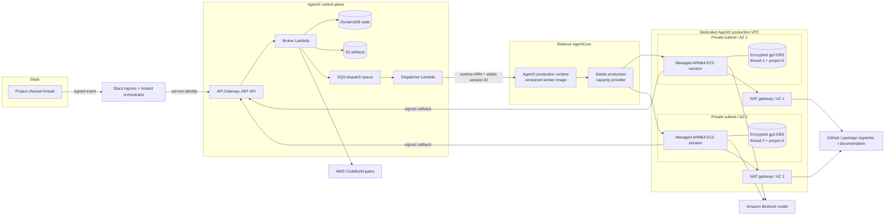
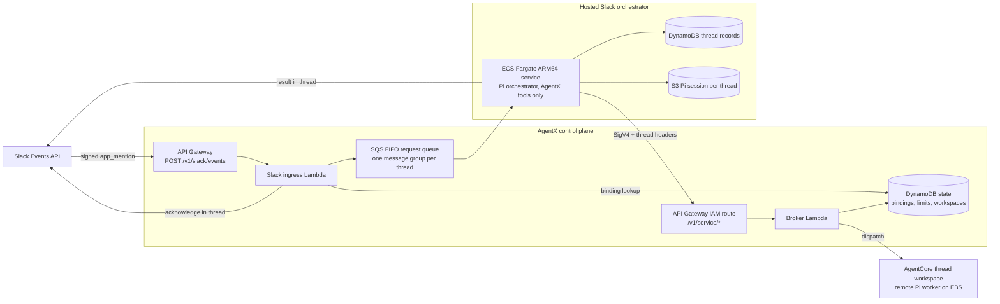

# AgentX production architecture

This is the production target for AgentX. It replaces the demo runtime's temporary managed
session storage with one isolated, encrypted EBS workspace per Slack thread. The
control plane remains stateless at the request-processing layer; DynamoDB stores durable platform
state and AgentCore owns compute-session lifecycle.

## Isolation and persistence

The control plane assigns a distinct AgentCore `runtimeSessionId` to every thread workspace.
AgentCore routes the pair `(capacityProviderArn, runtimeSessionId)` to one managed EC2 session and
one EBS workspace volume. Two threads therefore receive different instances and volumes even when
they use the same shared project definition, and each thread's members see the other thread's work
only through Git commits and remote branches.

The instance stops after five idle minutes to bound EC2 cost. A later invocation using the same
session ID starts managed compute and reattaches the existing EBS volume. The maximum compute
lifetime is 14 days, but the volume remains associated with the session across stop/resume. An
administrator must explicitly delete the AgentCore session or capacity provider to delete its
managed persistent volume.

## Hosted Slack orchestrator

Slack requests are orchestrated in AWS rather than on a developer machine, and since the
Slack-only retirement this is the only way coding work reaches AgentX. Each Slack thread is its own
workspace owner, so a thread receives its own AgentCore session and EBS volume. Every channel
member who posts in the thread shares that workspace.

- **Ingress.** The ingress Lambda verifies Slack's signature, ignores anything that is not a human
  `app_mention` in a bound channel of the same Slack organization, suppresses duplicate
  deliveries, and acknowledges in the thread before queueing. It can read only channel bindings
  from the state table.
- **Ordering.** The FIFO message group is the thread, so requests in one thread run in order while
  different threads run in parallel. The Slack event ID is the deduplication ID.
- **Orchestration.** The Fargate service runs the Pi orchestrator from `@agentx/orchestrator`,
  restricted to AgentX orchestration tools. It restores the thread's Pi session from S3 before each turn and
  saves it afterward. Tool request IDs derive from the Slack event ID, so a redelivered request
  resumes the operations it already started instead of creating duplicates.
- **Service identity.** The orchestrator calls the control plane through an `AWS_IAM` route that
  accepts only its task role. The broker derives the workspace owner from the signed Slack thread
  headers, and requires a bound channel. The resulting owner keys are disjoint from administrator
  logins, so the service identity cannot reach another thread's workspace, and the OIDC entry
  point serves administration only. Each operation records the Slack member who requested it.
- **Limits.** Creating a thread workspace checks per-starter and per-organization counters (3 and
  20 by default) in the same DynamoDB transaction that creates the workspace, so concurrent threads
  cannot exceed either limit.
- **Network.** The Fargate tasks run in the production VPC's private subnets with no public IP and
  outbound HTTPS only. Slack tokens and the signing secret stay in Secrets Manager.

`AgentXControlPlane` owns the ingress, queue, thread storage, Slack secret, and orchestrator task
role, because the broker must know that role before the service exists. `AgentXSlackOrchestrator`
owns only the ECS service, and receives those values as parameters from the release command.

## Stable foundation versus releasable runtime

`AgentXProductionFoundation` owns the resources whose identity must remain stable:

- Dedicated `10.42.0.0/16` VPC across two supported availability-zone IDs.
- Two public NAT subnets and two private worker subnets, with a NAT gateway in each AZ.
- A worker security group with no ingress and outbound TCP 443 only.
- A free S3 gateway endpoint and VPC flow logs retained for 30 days.
- A rotating customer-managed KMS key retained for workspace recovery safety.
- The retained ARM64 capacity provider, `m6g.medium` compute policy, encrypted root volume, and a
  named 20 GiB gp3 `workspace` volume.

`AgentXProductionRuntime` owns the changeable application layer:

- The immutable worker image digest.
- The runtime execution role for ECR, Bedrock inference, logs, traces, and metrics.
- Model and control-plane callback configuration.
- The mount from the capacity provider's `workspace` volume to `/mnt/workspace`.

Updating the runtime creates a new AgentCore runtime version behind the same runtime resource and
`DEFAULT` endpoint. It does not replace the capacity provider or change a workspace's session ID.
Consequently, normal AgentX releases do not require registration or workspace preparation again.

## Deployment safety

Both production stacks have CloudFormation termination protection. The capacity provider, runtime,
KMS key, and flow-log group also use retain policies. The production release command creates the
foundation only when absent. On later runs it fails if the synthesized foundation differs from the
deployed foundation, requiring a separate review for any network, encryption, instance, lifecycle,
or volume change.

The production ECR repository uses immutable tags, scan-on-push, seven-day cleanup for untagged
images, and bounded retention for releases and legacy tags. Runtime logs are retained for 30 days.

## One-time migration boundary

Deploying these stacks does not migrate anything. Migration begins only when an administrator
binds a project revision/workspace to the production runtime and restores or re-clones its working
state into the new EBS-backed session. Until then, existing demo runtime sessions and control-plane
workspace records are unchanged and continue to operate.

The migration procedure must inventory each current workspace, decide whether uncommitted demo
changes need to be carried over, create or update the production binding, prepare the EBS-backed
workspace, verify repository state and readiness, and only then retire the old demo session. Each
of those actions is independently observable and reversible until the old session is explicitly
deleted.

## Environments

AgentX can run more than one independent deployment (for example `production` and `staging`) in
the same AWS account and region, selected everywhere with `--env <name>` (default `production`).
Each gets its own physical names: stacks `agentx-<env>-foundation/-runtime/-control-plane/-slack`,
AgentCore runtime `agentx_<env>_worker`, alerts topic `agentx-<env>-alerts`, connector secrets
`agentx/<env>/connectors/<name>`, metrics namespace `AgentX/<env>`, and SSM settings under
`/agentx/<env>/`. The name `connectors` is reserved and cannot be used as an environment name.

The deployment described above predates environments and keeps its fixed legacy names
(`AgentXProductionFoundation`, `AgentXProductionRuntime`, `AgentXControlPlane`,
`AgentXSlackOrchestrator`, runtime `agentx_production_worker`) forever. It must be adopted as the
`production` environment with `agentx --env production env adopt --region us-east-1`, which only
reads its CloudFormation stacks and caller identity and writes settings to SSM; it never changes
the stacks. A fresh `agentxEnv=production` install must never be deployed into the same account
beside it: the two would collide on the AgentCore runtime name `agentx_production_worker`.

`agentx env list` shows the environments installed in this account and region; `agentx --env
<name> env use` rebuilds this machine's local settings cache for `<name>` from SSM. Any command
that writes an environment's settings takes an SSM-backed lock at `/agentx/<env>/lock`: it names
its holder and start time, refuses a fresh lock held by someone else, and allows takeover of a
lock older than two hours only with explicit confirmation.
