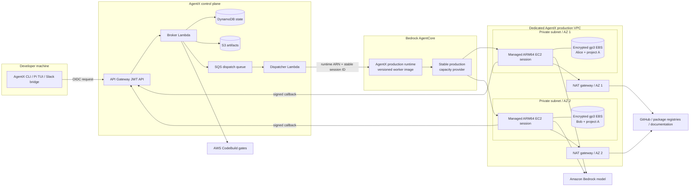

# AgentX production architecture

This is the production target for AgentX. It replaces the demo runtime's temporary managed
session storage with one isolated, encrypted EBS workspace per developer/project session. The
control plane remains stateless at the request-processing layer; DynamoDB stores durable platform
state and AgentCore owns compute-session lifecycle.

## Isolation and persistence

The control plane assigns a distinct AgentCore `runtimeSessionId` to every developer/project
workspace. AgentCore routes the pair `(capacityProviderArn, runtimeSessionId)` to one managed EC2
session and one EBS workspace volume. Alice and Bob therefore receive different instances and
volumes even when they use the same shared project definition. They see each other's work only
through Git commits and remote branches.

The instance stops after 15 idle minutes to bound EC2 cost. A later invocation using the same
session ID starts managed compute and reattaches the existing EBS volume. The maximum compute
lifetime is 14 days, but the volume remains associated with the session across stop/resume. An
administrator must explicitly delete the AgentCore session or capacity provider to delete its
managed persistent volume.

## Stable foundation versus releasable runtime

`AgentXProductionFoundation` owns the resources whose identity must remain stable:

- Dedicated `10.42.0.0/16` VPC across two supported availability-zone IDs.
- Two public NAT subnets and two private worker subnets, with a NAT gateway in each AZ.
- A worker security group with no ingress and outbound TCP 443 only.
- A free S3 gateway endpoint and VPC flow logs retained for 30 days.
- A rotating customer-managed KMS key retained for workspace recovery safety.
- The retained ARM64 capacity provider, `m7g.large` compute policy, encrypted root volume, and a
  named 100 GiB gp3 `workspace` volume.

`AgentXProductionRuntime` owns the changeable application layer:

- The immutable worker image digest.
- The runtime execution role for ECR, Bedrock inference, logs, traces, and metrics.
- Model and control-plane callback configuration.
- The mount from the capacity provider's `workspace` volume to `/mnt/workspace`.

Updating the runtime creates a new AgentCore runtime version behind the same runtime resource and
`DEFAULT` endpoint. It does not replace the capacity provider or change a workspace's session ID.
Consequently, normal AgentX releases do not require registration or workspace preparation again.

## Deployment safety

Both production stacks have CloudFormation termination protection. The capacity provider, runtime,
KMS key, and flow-log group also use retain policies. The production release command creates the
foundation only when absent. On later runs it fails if the synthesized foundation differs from the
deployed foundation, requiring a separate review for any network, encryption, instance, lifecycle,
or volume change.

The production ECR repository uses immutable tags, scan-on-push, seven-day cleanup for untagged
images, and bounded retention for releases and legacy tags. Runtime logs are retained for 30 days.

## One-time migration boundary

Deploying these stacks does not migrate anything. Migration begins only when an administrator
binds a project revision/workspace to the production runtime and restores or re-clones its working
state into the new EBS-backed session. Until then, existing demo runtime sessions and control-plane
workspace records are unchanged and continue to operate.

The migration procedure must inventory each current workspace, decide whether uncommitted demo
changes need to be carried over, create or update the production binding, prepare the EBS-backed
workspace, verify repository state and readiness, and only then retire the old demo session. Each
of those actions is independently observable and reversible until the old session is explicitly
deleted.
