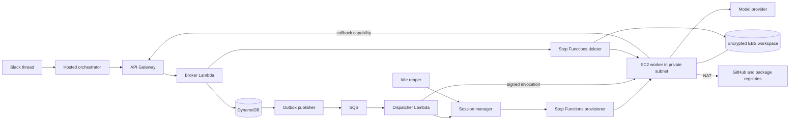
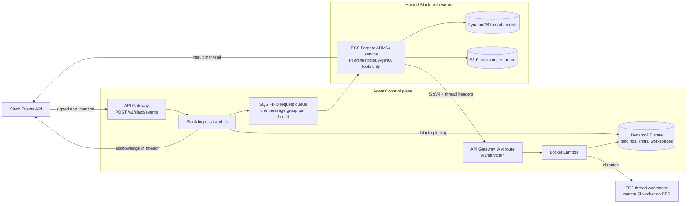

# AgentX production architecture

Every install uses EC2 workers with one isolated, encrypted EBS volume per Slack thread.
DynamoDB stores platform state; Step Functions manages compute and volume lifecycle.

## Isolation and persistence

Each workspace has a SESSION record naming its EC2 instance, EBS volume, availability zone and
session generation. The project binding supplies the launch template, private subnets and volume
settings. A volume stays in its original availability zone across replacement instances.

The dispatcher signs each invocation for the workspace, generation, operation and fence. Work
waits outside the dispatch queue while the session provisioner starts compute. The worker verifies
the signature before accepting the invocation. Session generations fence stale workers.

The reaper stops idle compute and enforces the maximum lifetime; the EBS volume remains for the
next session. Closing a clean workspace invokes the deleter to terminate compute and delete its
volume. Workspace and operation records remain as audit history.

## Devcontainers

A project may name a devcontainer (`devcontainer: { repository, configPath? }`, with `configPath`
defaulting to `.devcontainer/devcontainer.json`). Only EC2 workers run one; registration refuses it
on any other deployment mode. On an EC2 worker:

- The worker container gets the host's Docker socket and runs the devcontainer CLI, so the
  devcontainer and any Compose services it declares run on the instance's own Docker.
- The whole workspace volume is mounted into the devcontainer at `/mnt/workspace`, the same path as
  on the host and in the worker, so a path means the same file to the agent's file tools and to a
  command in the container.
- Preparation starts the devcontainer after cloning and runs `setup` and `readiness` in it. Every
  task starts it again first, since a resumed instance has its containers stopped, and the agent's
  shell runs in it.
- Docker's data root is `/mnt/workspace/.docker`, so images, containers and named volumes (a
  database, for example) survive an idle stop.

The Docker socket makes the worker root on its instance. Each instance serves one workspace, so that
reaches only this workspace's volume and the instance role, which the worker holds already.

## Hosted Slack orchestrator

Slack requests are orchestrated in AWS rather than on a developer machine, and since the
Slack-only retirement this is the only way coding work reaches AgentX. Each Slack thread is its own
workspace owner, so a thread receives its own EC2 session and EBS volume. Every channel
member who posts in the thread shares that workspace.

- **Ingress.** The ingress Lambda verifies Slack's signature, ignores anything that is not a human
  `app_mention` in a bound channel of the same Slack organization, suppresses duplicate
  deliveries, and acknowledges in the thread before queueing. It can read only channel bindings
  from the state table.
- **Ordering.** The FIFO message group is the thread, so requests in one thread run in order while
  different threads run in parallel. The Slack event ID is the deduplication ID.
- **Orchestration.** The Fargate service runs the Pi orchestrator from `@agentx/orchestrator`,
  restricted to AgentX orchestration tools. It restores the thread's Pi session from S3 before each turn and
  saves it afterward. Tool request IDs derive from the Slack event ID, so a redelivered request
  resumes the operations it already started instead of creating duplicates.
- **Service identity.** The orchestrator calls the control plane through an `AWS_IAM` route that
  accepts only its task role. The broker derives the workspace owner from the signed Slack thread
  headers, and requires a bound channel. The resulting owner keys are disjoint from administrator
  logins, so the service identity cannot reach another thread's workspace, and the OIDC entry
  point serves administration only. Each operation records the Slack member who requested it.
- **Limits.** Creating a thread workspace checks per-starter and per-organization counters (3 and
  20 by default) in the same DynamoDB transaction that creates the workspace, so concurrent threads
  cannot exceed either limit.
- **Network.** The Fargate tasks run in the production VPC's private subnets with no public IP and
  outbound HTTPS only. Slack tokens and the signing secret stay in Secrets Manager.

`AgentXControlPlane` owns the ingress, queue, thread storage, Slack secret, and orchestrator task
role, because the broker must know that role before the service exists. `AgentXSlackOrchestrator`
owns only the ECS service, and receives those values as parameters from the release command.

## Stable foundation versus releasable runtime

`AgentXProductionFoundation` owns the resources whose identity must remain stable:

- Dedicated `10.42.0.0/16` VPC across two supported availability-zone IDs.
- Two public NAT subnets and two private worker subnets, with a NAT gateway in each AZ.
- A free S3 gateway endpoint and VPC flow logs retained for 30 days.
- A rotating customer-managed KMS key retained for workspace recovery safety.
- The EC2 worker foundation: the `m6g.medium` arm64 launch template, the worker instance role and
  profile, and the worker, dispatcher and session-manager security groups.

`AgentXProductionRuntime` holds the EC2 worker settings as SSM parameters:

- `/agentx/production/worker-image`: the immutable worker image digest.
- `/agentx/production/worker-model-provider`, `worker-model-id` and `worker-prompt-cache-retention`.

The session provisioner reads them when it boots a worker, so a release reaches each workspace the
next time its compute starts; a worker already running keeps its image until the idle reaper stops
it. Normal AgentX releases do not require registration or workspace preparation again.

## Deployment safety

Both production stacks have CloudFormation termination protection. The KMS key and flow-log group
also use retain policies. The production release command creates the
foundation only when absent. On later runs it fails if the synthesized foundation differs from the
deployed foundation, requiring a separate review for any network, encryption, instance, lifecycle,
or volume change.

The production ECR repository uses immutable tags, scan-on-push, seven-day cleanup for untagged
images, and bounded retention for releases and legacy tags.

## Historical records

Retired `instances-ebs` and `demo-microvm` records remain readable for audit, including closed
workspaces, operations and project revisions. They cannot create or resume compute. Administrators
register a new `ec2-ebs` project revision and users start a new Slack thread for new work.
This policy applies to hosted and self-hosted installs, including `agentx init`.

## Environments

AgentX can run more than one independent deployment (for example `production` and `staging`) in
the same AWS account and region, selected everywhere with `--env <name>` (default `production`).
Each gets its own physical names: stacks `agentx-<env>-access/-foundation/-runtime/-control-plane/-slack`,
alerts topic `agentx-<env>-alerts`, connector secrets
`agentx/<env>/connectors/<name>`, metrics namespace `AgentX/<env>`, and SSM settings under
`/agentx/<env>/`. The name `connectors` is reserved and cannot be used as an environment name.

The deployment described above predates environments and keeps its fixed legacy names
(`AgentXProductionFoundation`, `AgentXProductionRuntime`, `AgentXControlPlane`,
`AgentXSlackOrchestrator`) forever. It must be adopted as the
`production` environment with `agentx --env production env adopt --region us-east-1`, which only
reads its CloudFormation stacks and caller identity and writes settings to SSM; it never changes
the stacks. A fresh `agentxEnv=production` install must never be deployed into the same account
beside it: the deployments share the production settings prefix.

`agentx env list` shows the environments installed in this account and region; `agentx --env
<name> env use` rebuilds this machine's local settings cache for `<name>` from SSM. Any command
that writes an environment's settings takes an SSM-backed lock at `/agentx/<env>/lock`: it names
its holder and start time, refuses a fresh lock held by someone else, and allows takeover of a
lock older than two hours only with explicit confirmation.

## Access stack

Every named environment's first stack, `agentx-<env>-access`, deploys with the installing admin's
own AWS rights, because a role cannot deploy the stack that creates it. It holds a private,
versioned artifact bucket (retained if the stack is ever deleted) for release code packages and
rendered templates; an ECR pull-through cache rule (prefix `agentx-<env>`, upstream
`public.ecr.aws`) so the worker and Slack service pull AgentX's public images through private ECR
in the account (the cache repository is created on first pull); the `agentx-<env>-cloudformation` service role
that deploys every other stack; and the `agentx-<env>-operator` role for day-to-day `agentx`
commands, which trusts the account root for 1-hour sessions unless an `OperatorPrincipalArn`
parameter names another principal.

Every other environment role lives under the IAM path `/agentx/<env>/`, not just a name prefix:
CloudFormation can truncate a generated role name past its `agentx-<env>-` prefix, and a name
prefix could also match a differently-named sibling environment (`agentx-prod-*` also matches
`prod-eu`). A path cannot collide, because `/` is not a legal character inside an environment name.
The access stack's own two roles stay at the IAM root path, outside the service role's reach.

The **service role** may use the listed AWS services broadly, but its IAM actions are limited to
roles under that path. It cannot create a role without the environment's permission boundary, and
cannot change or remove a role's boundary once set.

**A permission boundary always applies.** When the company gives no `PermissionsBoundaryArn`, the
access stack creates a default boundary, the managed policy `agentx-<env>-boundary` under
`/agentx/<env>/` (so its ARN is fixed and every other stack can name it), and every environment
role, the access stack's two roles included, carries it. The `EffectiveBoundaryArn` output names
whichever boundary is in force. The default boundary allows the AWS services AgentX's roles use
(a generated test keeps that list complete and adds nothing unused), role actions and `PassRole`
only for roles under `/agentx/<env>/` (plus the service role itself), and a few
service-linked roles. It explicitly denies Organizations and Account changes, anything on IAM users
or groups, creating, versioning or deleting managed policies, and changing the boundary itself. A
company-supplied boundary replaces the default entirely, so it must allow every action AgentX's
roles need.

What this does and does not protect, plainly:

- The operator role can deploy CloudFormation through the service role, so it is powerful within
  the account: it can create and change any resource of the services AgentX uses.
- The boundary stops it creating roles or policies beyond AgentX's own needs: no IAM users or
  groups, no managed-policy management, no Organizations or Account changes, and every role it
  creates carries the boundary.
- Environments that share one AWS account are **not** a security boundary against each other.
  Names and IAM paths keep them apart for IAM, but resource policies and non-IAM access (S3, KMS,
  Secrets Manager, SQS and the like) can still reach across environments in the same account.
- A dedicated AWS account per install is recommended (spec 015, FR-015).

**Changing the boundary later.** Update the access stack first, then every other environment stack
with the same new `PermissionsBoundaryArn`, in upgrade order (foundation, identity, runtime,
control-plane, slack). The service role's Deny statements follow the access stack, so a stack
deployed with a different boundary than the access stack's is refused. When switching from the
default boundary to a company boundary, the old `agentx-<env>-boundary` policy may be left behind:
roles still use it while the switch is in progress, so CloudFormation cannot always remove it
cleanly. Once every stack carries the new boundary, delete the leftover policy by hand.

**Reinstalling an environment name.** The environment's Slack secret `agentx/<env>/slack` is kept
when the control-plane stack is deleted. Reinstalling the same environment name needs that secret
deleted first, with `--force-delete-without-recovery` if it is still in its recovery window;
otherwise the new stack cannot create a secret of the same name.

The **operator role** may create, describe and execute change sets only for the five non-access
stacks, by their exact names, and read all six (including the access stack). It may pass only the
service role, and only to CloudFormation. It can read and write its environment's SSM settings
(`/agentx/<env>/*`) and Secrets Manager secrets (`agentx/<env>/*`), read and write the artifact
bucket, list cached images, call `bedrock:InvokeModel` as a model check, and read its stacks' and
the EC2 worker logs.

A public image `public.ecr.aws/<alias>/<repo>@sha256:<digest>` reaches the runtime as
`<account>.dkr.ecr.<region>.amazonaws.com/agentx-<env>/<alias>/<repo>@sha256:<digest>`, private ECR
in the account. `PermissionsBoundaryArn` is optional on every environment stack, access included;
every `AWS::IAM::Role` in every environment stack carries the given boundary, else the default one.

## Installing with agentx init

`agentx init --env <name>` (`npx @charterarc/agentx init`) walks an engineer from AWS credentials to a
deployed AgentX environment with its own GitHub App and Slack app. For this first run it needs AWS admin
credentials, a GitHub organization or personal account to own the GitHub App, and a Slack workspace where
the engineer can create apps. Day-2 commands then use the narrower operator role.

`init` asks its questions, then checks prerequisites (the region, model access, and the chosen engine's
tooling), shows the plan and an estimated cost, then runs its steps in order, recording each one in SSM
as it finishes:

1. **prerequisites**: the checks above (already run on a first run; a resumed run runs them here).
2. **access**: the access stack, deployed with the caller's own AWS credentials.
3. **core**: foundation and identity (skipped when bringing your own OIDC).
4. **the GitHub App**: one click on GitHub's pre-filled manifest page creates the app; then choose which
   repositories it may use. A GitHub App made beforehand can be used instead, with `--github-app-id`,
   `--github-installation-id` and `--github-private-key-file` (or `-env`); its private key cannot be
   pasted into a hidden prompt because it spans several lines.
5. **control-plane**: the control plane and runtime.
6. **the Slack app**: create it from AgentX's manifest, install it to the workspace, then paste the Bot
   User OAuth Token and the Signing Secret into two hidden prompts.
7. **slack-service**: the Slack service, a signed self-probe of both Slack URLs, then a request to
   confirm the app's Event Subscriptions page shows "Verified" (Slack has no API that reports this).

Every question has a flag (`--engine`, `--identity`, `--orchestrator-model`, `--github-account`, and so
on). `--yes` answers every question with its default or its flag and accepts every confirmation except a
broken Slack probe, which still fails; it also needs `--region`, so a resumed run never looks in the
wrong region. Without `--yes`, the region question defaults to `AWS_REGION`, then `AWS_DEFAULT_REGION`,
when the release covers it. Secrets (an alert webhook, the GitHub App private key, the Slack
bot token, the Slack signing secret, the OpenRouter API key) are never a flag's value: each comes from a
hidden prompt, or from `--<name>-file <path>` or `--<name>-env <NAME>`.

The model questions start with the provider: Amazon Bedrock (the default) or OpenRouter
(`--model-provider`). OpenRouter asks for the orchestrator, classifier and worker model ids, then the
OpenRouter API key in a hidden prompt (`--openrouter-key-file` or `--openrouter-key-env` with `--yes`).
See [OpenRouter model access](openrouter.md).

Before creating anything, `init` prints every stack, role, secret and app it will create, and an
estimated monthly cost for the chosen models at a stated usage (1,000 turns, 100 worker sessions, 60
worker instance-hours, 10 kept workspaces a month, us-east-1 list prices). This is an estimate, not a
bill; usage and regional pricing determine the actual cost.

Running `agentx init --env <name>` again resumes at the first incomplete step; a completed step never
runs again. When the Slack workspace needs an admin to approve new apps, the Slack app step exits with
status "waiting" (exit code 0, nothing failed): once approved, run `agentx init` again to continue. A
terminal closed mid-run leaves the environment's lock held; the same caller's next `agentx init` offers to
take it over at once, while a different caller must wait for it to go stale (two hours). `--yes` refuses
every takeover, even of its own lock: run `agentx init` without `--yes` to be asked.

`--no-browser` prints every address instead of opening one. When a browser cannot be opened (no
`xdg-open` on CloudShell, an SSH host or a container), `init` says so and carries on as if
`--no-browser` were given. For the GitHub App: open the printed address
through an SSH tunnel (`ssh -L <port>:127.0.0.1:<port> <this host>`) from another machine, or directly on
the same machine, then paste back the address GitHub sent your browser to (or just its code).

State lives in SSM beside the environment's settings: `/agentx/<env>/install/answers` (the answers, no
secret) and `/agentx/<env>/install/progress` (step outcomes and the GitHub and Slack facts collected so
far). `/agentx/<env>/settings` is written only once the Slack stack exists. Secrets go straight into
Secrets Manager: `agentx/<env>/github-app`, `agentx/<env>/slack`, for a webhook alert address
`agentx/<env>/alert-endpoint`, and, for OpenRouter without `--openrouter-secret-arn`,
`agentx/<env>/openrouter` (the raw key; the answers hold only its ARN). The alert and OpenRouter secrets
are stored just before the answers are saved, so a secret that fails to store leaves no answers and the
next run asks again; once the answers are saved, a rerun resumes without asking.

Until a later AgentX release adds them to `init` (phase 15d2), finish the install by hand: create your
admin user (Cognito: `aws cognito-idp admin-create-user` then `admin-add-user-to-group`; your own OIDC:
mark yourself an administrator there), then `agentx login --env <name>`, then `agentx admin project
register` and `agentx admin slack bind` to register a project and bind its channel.

## Deploying an environment

`agentx deploy` installs or upgrades one environment's stacks: access, foundation, identity (skipped when
the environment brings its own OIDC), control-plane, runtime and slack, in that order for a fresh install;
an upgrade deploys runtime before control-plane instead, so the worker (the tolerant side) parses strictly
first. Access deploys first, with the caller's own AWS credentials; every later stack deploys through the
service role the access stack creates.

Two engines deploy the same release:
- **templates** (the default). Deploys the release's pre-synthesized templates as a change set. Needs no
  local checkout and no CDK bootstrap; use this for most installs and enterprise pipelines.
- **cdk**. Runs `cdk deploy` from a real source checkout, one stack at a time; pick it for CDK's own drift
  reconciliation or asset diffing. Requires `--source <path>` and `--yes` (there is no change-set review to
  confirm), a clean checkout at tag `v<version>` for the release, and a region CDK has already been
  bootstrapped in. After those checks it runs `npm ci` and `npm run build` in the checkout (the built
  `infra/dist` is not in git, so a checkout at the right tag can still hold a stale build), then
  `npx --no-install cdk deploy`, the CDK CLI from the release's own lockfile.

With the templates engine, before executing, `agentx deploy` prints each stack's changes (action, logical
id, resource type, whether it replaces the resource) and asks "Execute this change set? [y/N]", unless
`--yes` is given; with no `--yes` and no terminal on stdin, it refuses rather than guessing. A change set
that fails only because it has no changes is deleted and treated as success ("no changes"), and the stack's
existing outputs are used as-is.

Before any AWS write, `agentx deploy` refuses (with `CONFIG_INVALID`) AWS credentials for a different
account than the answers file names, a region the release does not cover (templates engine), and your own
OIDC provider without `adminClaim`, `adminValues` and `clientId`. Missing or expired AWS credentials fail
with `AUTH_REQUIRED`, an AWS access denial with `FORBIDDEN`. Use credentials whose session lasts at least as
long as the deploy (plan for about an hour): a session that expires partway leaves the rest undeployed.

**Recovering a stuck stack.** A stack in `ROLLBACK_COMPLETE` (its first create failed) must be deleted
before deploying again; the error names the exact `delete-stack` command. A failed create keeps the
resources its stack retains, so remove those too (see "Tearing down an environment"). A failed or refused
change set on a new stack leaves it in `REVIEW_IN_PROGRESS` with no resources: `agentx deploy` deletes its
own change set and a rerun treats the stack as a fresh create; to clean up by hand (for example after
`deploy-access.sh`), delete the change set, then delete the stack only if it is still REVIEW_IN_PROGRESS with
no resources. A failed install resumes with `--parts`, naming only the parts still needed; when settings
were not written, `agentx deploy` prints the deployed and missing parts and the exact command to resume. An
environment adopted from the legacy deployment (fixed stack names, none of the `agentx-<env>-` naming) is
refused by `agentx deploy`.

**Regions.** A release only covers the regions it was built for (today: `us-east-1`), each with its own
verified availability-zone IDs and its own templates (`templates/<region>/<part>.template.json`).
An uncovered region is refused, by name. Adding a region means adding its verified zone IDs to
`DEFAULT_AZ_IDS` in `infra/lib/production-foundation.ts`; the release builder picks the region up from
there, and nothing else about deploy changes.

**The export bundle** (`agentx init --export`, requiring an explicit `--env` and refusing the name
`production`) writes what a platform team needs to deploy the access stack themselves, with their own
credentials and no AWS call ever made by our CLI: templates, parameters, a `deploy-access.sh` script, and
the policy that principal needs. That policy is for creating the stack only; updating it later needs a
broader principal, the operator's job. The ECR pull-through rule's create and delete actions cannot be
scoped to a resource, so that statement stays on every resource (`*`). `deploy-access.sh` prompts for
confirmation before executing (`--yes` skips it, same as `agentx deploy`), and prints the failure reason
plus the exact recovery command on failure. It does not create the callback signing key; `agentx deploy`
creates it on its first run. Every later stack is then deployed by the AgentX operator, through the role the
access stack created, with `agentx deploy --mode install --parts foundation,identity,control-plane,runtime,slack
--release <dir> --answers <file>` (never access: the operator role is denied change sets on it).

**The callback signing key** lives only in Secrets Manager, at `agentx/<env>/callback-signing-key`, never in
settings. The templates engine passes it to CloudFormation as a `NoEcho` parameter, never printed. The cdk
engine can only pass it as a `cdk deploy --parameters` argument, so for that command's length it is visible
in the operator's own machine's process list (the engines' one difference in secret handling); it stays
redacted everywhere `agentx` itself prints anything, including the displayed command, any error, and the
streamed output.

### Tearing down an environment

`agentx destroy` is planned for phase 15e; until then, teardown is by hand. Turn termination protection off
on access, foundation, identity and runtime, then delete the stacks in reverse install order (slack, runtime,
control-plane, identity, foundation, access).

Between deleting the control-plane stack and the foundation stack, tear down the EC2 workers: they are
launched by Step Functions, outside CloudFormation, so their instances and volumes survive every stack
delete above and are never removed by CloudFormation. List instances tagged `Environment=<env>` and
`DeploymentMode=ec2-ebs` with `aws ec2 describe-instances`, terminate them, and wait with `aws ec2 wait
instance-terminated`; then list and delete the volumes carrying the same tags with `aws ec2 describe-volumes`
and `aws ec2 delete-volume`. A worker instance still running in the worker security group blocks the
foundation stack's delete. The export bundle's README lists the exact commands, each naming its region.

Stack deletion keeps, on purpose: the Cognito user pool (deletion protection), three
S3 buckets (two versioned: empty every version and delete marker first), three DynamoDB tables, the VPC
flow-log group, and the KMS workspace key (schedule deletion; 7 days minimum). Two secrets live outside or beyond the
stacks: `agentx/<env>/callback-signing-key` (created by the CLI) and `agentx/<env>/slack`; delete both with
`--force-delete-without-recovery` so a new install can reuse the names. An install made with `agentx init`
also has the secrets init stored itself: `agentx/<env>/github-app`, `agentx/<env>/alert-endpoint` (a
webhook alert address only) and `agentx/<env>/openrouter` (OpenRouter without `--openrouter-secret-arn`
only); delete them the same way. Revoke the OpenRouter key in OpenRouter too. A secret you made yourself
for `--openrouter-secret-arn` is yours to keep or delete.
A failed create keeps its retained resources too, so "delete the stack and rerun" leaves them behind. The
export bundle's README lists the exact command for each step.
