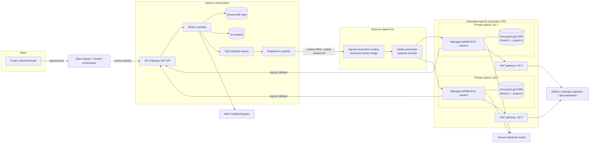
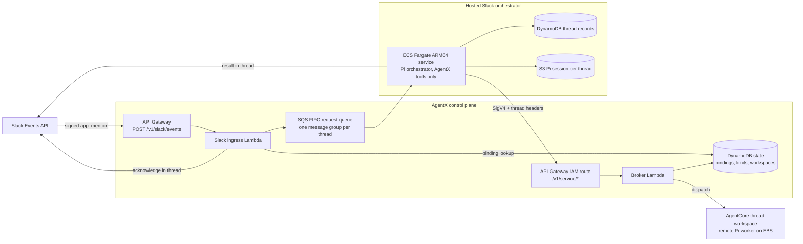

# AgentX production architecture

This is the production target for AgentX. It replaces the demo runtime's temporary managed
session storage with one isolated, encrypted EBS workspace per Slack thread. The
control plane remains stateless at the request-processing layer; DynamoDB stores durable platform
state and AgentCore owns compute-session lifecycle.

## Isolation and persistence

The control plane assigns a distinct AgentCore `runtimeSessionId` to every thread workspace.
AgentCore routes the pair `(capacityProviderArn, runtimeSessionId)` to one managed EC2 session and
one EBS workspace volume. Two threads therefore receive different instances and volumes even when
they use the same shared project definition, and each thread's members see the other thread's work
only through Git commits and remote branches.

The instance stops after five idle minutes to bound EC2 cost. A later invocation using the same
session ID starts managed compute and reattaches the existing EBS volume. The maximum compute
lifetime is 14 days, but the volume remains associated with the session across stop/resume. An
administrator must explicitly delete the AgentCore session or capacity provider to delete its
managed persistent volume.

## Hosted Slack orchestrator

Slack requests are orchestrated in AWS rather than on a developer machine, and since the
Slack-only retirement this is the only way coding work reaches AgentX. Each Slack thread is its own
workspace owner, so a thread receives its own AgentCore session and EBS volume. Every channel
member who posts in the thread shares that workspace.

- **Ingress.** The ingress Lambda verifies Slack's signature, ignores anything that is not a human
  `app_mention` in a bound channel of the same Slack organization, suppresses duplicate
  deliveries, and acknowledges in the thread before queueing. It can read only channel bindings
  from the state table.
- **Ordering.** The FIFO message group is the thread, so requests in one thread run in order while
  different threads run in parallel. The Slack event ID is the deduplication ID.
- **Orchestration.** The Fargate service runs the Pi orchestrator from `@agentx/orchestrator`,
  restricted to AgentX orchestration tools. It restores the thread's Pi session from S3 before each turn and
  saves it afterward. Tool request IDs derive from the Slack event ID, so a redelivered request
  resumes the operations it already started instead of creating duplicates.
- **Service identity.** The orchestrator calls the control plane through an `AWS_IAM` route that
  accepts only its task role. The broker derives the workspace owner from the signed Slack thread
  headers, and requires a bound channel. The resulting owner keys are disjoint from administrator
  logins, so the service identity cannot reach another thread's workspace, and the OIDC entry
  point serves administration only. Each operation records the Slack member who requested it.
- **Limits.** Creating a thread workspace checks per-starter and per-organization counters (3 and
  20 by default) in the same DynamoDB transaction that creates the workspace, so concurrent threads
  cannot exceed either limit.
- **Network.** The Fargate tasks run in the production VPC's private subnets with no public IP and
  outbound HTTPS only. Slack tokens and the signing secret stay in Secrets Manager.

`AgentXControlPlane` owns the ingress, queue, thread storage, Slack secret, and orchestrator task
role, because the broker must know that role before the service exists. `AgentXSlackOrchestrator`
owns only the ECS service, and receives those values as parameters from the release command.

## Stable foundation versus releasable runtime

`AgentXProductionFoundation` owns the resources whose identity must remain stable:

- Dedicated `10.42.0.0/16` VPC across two supported availability-zone IDs.
- Two public NAT subnets and two private worker subnets, with a NAT gateway in each AZ.
- A worker security group with no ingress and outbound TCP 443 only.
- A free S3 gateway endpoint and VPC flow logs retained for 30 days.
- A rotating customer-managed KMS key retained for workspace recovery safety.
- The retained ARM64 capacity provider, `m6g.medium` compute policy, encrypted root volume, and a
  named 20 GiB gp3 `workspace` volume.

`AgentXProductionRuntime` owns the changeable application layer:

- The immutable worker image digest.
- The runtime execution role for ECR, Bedrock inference, logs, traces, and metrics.
- Model and control-plane callback configuration.
- The mount from the capacity provider's `workspace` volume to `/mnt/workspace`.

Updating the runtime creates a new AgentCore runtime version behind the same runtime resource and
`DEFAULT` endpoint. It does not replace the capacity provider or change a workspace's session ID.
Consequently, normal AgentX releases do not require registration or workspace preparation again.

## Deployment safety

Both production stacks have CloudFormation termination protection. The capacity provider, runtime,
KMS key, and flow-log group also use retain policies. The production release command creates the
foundation only when absent. On later runs it fails if the synthesized foundation differs from the
deployed foundation, requiring a separate review for any network, encryption, instance, lifecycle,
or volume change.

The production ECR repository uses immutable tags, scan-on-push, seven-day cleanup for untagged
images, and bounded retention for releases and legacy tags. Runtime logs are retained for 30 days.

## One-time migration boundary

Deploying these stacks does not migrate anything. Migration begins only when an administrator
binds a project revision/workspace to the production runtime and restores or re-clones its working
state into the new EBS-backed session. Until then, existing demo runtime sessions and control-plane
workspace records are unchanged and continue to operate.

The migration procedure must inventory each current workspace, decide whether uncommitted demo
changes need to be carried over, create or update the production binding, prepare the EBS-backed
workspace, verify repository state and readiness, and only then retire the old demo session. Each
of those actions is independently observable and reversible until the old session is explicitly
deleted.

## Environments

AgentX can run more than one independent deployment (for example `production` and `staging`) in
the same AWS account and region, selected everywhere with `--env <name>` (default `production`).
Each gets its own physical names: stacks `agentx-<env>-access/-foundation/-runtime/-control-plane/-slack`,
AgentCore runtime `agentx_<env>_worker`, alerts topic `agentx-<env>-alerts`, connector secrets
`agentx/<env>/connectors/<name>`, metrics namespace `AgentX/<env>`, and SSM settings under
`/agentx/<env>/`. The name `connectors` is reserved and cannot be used as an environment name.

The deployment described above predates environments and keeps its fixed legacy names
(`AgentXProductionFoundation`, `AgentXProductionRuntime`, `AgentXControlPlane`,
`AgentXSlackOrchestrator`, runtime `agentx_production_worker`) forever. It must be adopted as the
`production` environment with `agentx --env production env adopt --region us-east-1`, which only
reads its CloudFormation stacks and caller identity and writes settings to SSM; it never changes
the stacks. A fresh `agentxEnv=production` install must never be deployed into the same account
beside it: the two would collide on the AgentCore runtime name `agentx_production_worker`.

`agentx env list` shows the environments installed in this account and region; `agentx --env
<name> env use` rebuilds this machine's local settings cache for `<name>` from SSM. Any command
that writes an environment's settings takes an SSM-backed lock at `/agentx/<env>/lock`: it names
its holder and start time, refuses a fresh lock held by someone else, and allows takeover of a
lock older than two hours only with explicit confirmation.

## Access stack

Every named environment's first stack, `agentx-<env>-access`, deploys with the installing admin's
own AWS rights, because a role cannot deploy the stack that creates it. It holds a private,
versioned artifact bucket (retained if the stack is ever deleted) for release code packages and
rendered templates; an ECR pull-through cache rule (prefix `agentx-<env>`, upstream
`public.ecr.aws`) so the worker and Slack service pull AgentX's public images through private ECR
in the account (the cache repository is created on first pull); the `agentx-<env>-cloudformation` service role
that deploys every other stack; and the `agentx-<env>-operator` role for day-to-day `agentx`
commands, which trusts the account root for 1-hour sessions unless an `OperatorPrincipalArn`
parameter names another principal.

Every other environment role lives under the IAM path `/agentx/<env>/`, not just a name prefix:
CloudFormation can truncate a generated role name past its `agentx-<env>-` prefix, and a name
prefix could also match a differently-named sibling environment (`agentx-prod-*` also matches
`prod-eu`). A path cannot collide, because `/` is not a legal character inside an environment name.
The access stack's own two roles stay at the IAM root path, outside the service role's reach.

The **service role** may use the listed AWS services broadly, but its IAM actions are limited to
roles under that path. It cannot create a role without the environment's permission boundary, and
cannot change or remove a role's boundary once set.

**A permission boundary always applies.** When the company gives no `PermissionsBoundaryArn`, the
access stack creates a default boundary, the managed policy `agentx-<env>-boundary` under
`/agentx/<env>/` (so its ARN is fixed and every other stack can name it), and every environment
role, the access stack's two roles included, carries it. The `EffectiveBoundaryArn` output names
whichever boundary is in force. The default boundary allows the AWS services AgentX's roles use
(a generated test keeps that list complete and adds nothing unused), role actions and `PassRole`
only for roles under `/agentx/<env>/` (plus the service role itself, and AgentCore's default
instance role, which the capacity provider's AWS-managed policy passes to EC2), and a few
service-linked roles. It explicitly denies Organizations and Account changes, anything on IAM users
or groups, creating, versioning or deleting managed policies, and changing the boundary itself. A
company-supplied boundary replaces the default entirely, so it must allow every action AgentX's
roles need.

What this does and does not protect, plainly:

- The operator role can deploy CloudFormation through the service role, so it is powerful within
  the account: it can create and change any resource of the services AgentX uses.
- The boundary stops it creating roles or policies beyond AgentX's own needs: no IAM users or
  groups, no managed-policy management, no Organizations or Account changes, and every role it
  creates carries the boundary.
- Environments that share one AWS account are **not** a security boundary against each other.
  Names and IAM paths keep them apart for IAM, but resource policies and non-IAM access (S3, KMS,
  Secrets Manager, SQS and the like) can still reach across environments in the same account.
- A dedicated AWS account per install is recommended (spec 015, FR-015).

**Changing the boundary later.** Update the access stack first, then every other environment stack
with the same new `PermissionsBoundaryArn`, in upgrade order (foundation, identity, runtime,
control-plane, slack). The service role's Deny statements follow the access stack, so a stack
deployed with a different boundary than the access stack's is refused. When switching from the
default boundary to a company boundary, the old `agentx-<env>-boundary` policy may be left behind:
roles still use it while the switch is in progress, so CloudFormation cannot always remove it
cleanly. Once every stack carries the new boundary, delete the leftover policy by hand.

**Reinstalling an environment name.** The environment's Slack secret `agentx/<env>/slack` is kept
when the control-plane stack is deleted. Reinstalling the same environment name needs that secret
deleted first, with `--force-delete-without-recovery` if it is still in its recovery window;
otherwise the new stack cannot create a secret of the same name.

The **operator role** may create, describe and execute change sets only for the five non-access
stacks, by their exact names, and read all six (including the access stack). It may pass only the
service role, and only to CloudFormation. It can read and write its environment's SSM settings
(`/agentx/<env>/*`) and Secrets Manager secrets (`agentx/<env>/*`), read and write the artifact
bucket, list cached images, call `bedrock:InvokeModel` as a model check, and read its stacks' and
the AgentCore runtime's logs.

A public image `public.ecr.aws/<alias>/<repo>@sha256:<digest>` reaches the runtime as
`<account>.dkr.ecr.<region>.amazonaws.com/agentx-<env>/<alias>/<repo>@sha256:<digest>`, private ECR
in the account. `PermissionsBoundaryArn` is optional on every environment stack, access included;
every `AWS::IAM::Role` in every environment stack carries the given boundary, else the default one.

## Deploying an environment

`agentx deploy` installs or upgrades one environment's stacks: access, foundation, identity (skipped when
the environment brings its own OIDC), control-plane, runtime and slack, in that order for a fresh install;
an upgrade deploys runtime before control-plane instead, so the worker (the tolerant side) parses strictly
first. Access deploys first, with the caller's own AWS credentials; every later stack deploys through the
service role the access stack creates.

Two engines deploy the same release:
- **templates** (the default). Deploys the release's pre-synthesized templates as a change set. Needs no
  local checkout and no CDK bootstrap; use this for most installs and enterprise pipelines.
- **cdk**. Runs `cdk deploy` from a real source checkout, one stack at a time; pick it for CDK's own drift
  reconciliation or asset diffing. Requires `--source <path>` and `--yes` (there is no change-set review to
  confirm), a clean checkout at tag `v<version>` for the release, and a region CDK has already been
  bootstrapped in. After those checks it runs `npm ci` and `npm run build` in the checkout (the built
  `infra/dist` is not in git, so a checkout at the right tag can still hold a stale build), then
  `npx --no-install cdk deploy`, the CDK CLI from the release's own lockfile.

With the templates engine, before executing, `agentx deploy` prints each stack's changes (action, logical
id, resource type, whether it replaces the resource) and asks "Execute this change set? [y/N]", unless
`--yes` is given; with no `--yes` and no terminal on stdin, it refuses rather than guessing. A change set
that fails only because it has no changes is deleted and treated as success ("no changes"), and the stack's
existing outputs are used as-is.

Before any AWS write, `agentx deploy` refuses (with `CONFIG_INVALID`) AWS credentials for a different
account than the answers file names, a region the release does not cover (templates engine), and your own
OIDC provider without `adminClaim`, `adminValues` and `clientId`. Missing or expired AWS credentials fail
with `AUTH_REQUIRED`, an AWS access denial with `FORBIDDEN`. Use credentials whose session lasts at least as
long as the deploy (plan for about an hour): a session that expires partway leaves the rest undeployed.

**Recovering a stuck stack.** A stack in `ROLLBACK_COMPLETE` (its first create failed) must be deleted
before deploying again; the error names the exact `delete-stack` command. A failed create keeps the
resources its stack retains, so remove those too (see "Tearing down an environment"). A failed or refused
change set on a new stack leaves it in `REVIEW_IN_PROGRESS` with no resources: `agentx deploy` deletes its
own change set and a rerun treats the stack as a fresh create; to clean up by hand (for example after
`deploy-access.sh`), delete the change set, then delete the stack only if it is still REVIEW_IN_PROGRESS with
no resources. A failed install resumes with `--parts`, naming only the parts still needed; when settings
were not written, `agentx deploy` prints the deployed and missing parts and the exact command to resume. An
environment adopted from the legacy deployment (fixed stack names, none of the `agentx-<env>-` naming) is
refused by `agentx deploy`.

**Regions.** A release only covers the regions it was built for (today: `us-east-1`), each with its own
verified AgentCore availability-zone IDs and its own templates (`templates/<region>/<part>.template.json`).
An uncovered region is refused, by name. Adding a region means adding its verified zone IDs to
`DEFAULT_AZ_IDS` in `infra/lib/production-foundation.ts`; the release builder picks the region up from
there, and nothing else about deploy changes.

**The export bundle** (`agentx init --export`, requiring an explicit `--env` and refusing the name
`production`) writes what a platform team needs to deploy the access stack themselves, with their own
credentials and no AWS call ever made by our CLI: templates, parameters, a `deploy-access.sh` script, and
the policy that principal needs. That policy is for creating the stack only; updating it later needs a
broader principal, the operator's job. The ECR pull-through rule's create and delete actions cannot be
scoped to a resource, so that statement stays on every resource (`*`). `deploy-access.sh` prompts for
confirmation before executing (`--yes` skips it, same as `agentx deploy`), and prints the failure reason
plus the exact recovery command on failure. It does not create the callback signing key; `agentx deploy`
creates it on its first run. Every later stack is then deployed by the AgentX operator, through the role the
access stack created, with `agentx deploy --mode install --parts foundation,identity,control-plane,runtime,slack
--release <dir> --answers <file>` (never access: the operator role is denied change sets on it).

**The callback signing key** lives only in Secrets Manager, at `agentx/<env>/callback-signing-key`, never in
settings. The templates engine passes it to CloudFormation as a `NoEcho` parameter, never printed. The cdk
engine can only pass it as a `cdk deploy --parameters` argument, so for that command's length it is visible
in the operator's own machine's process list (the engines' one difference in secret handling); it stays
redacted everywhere `agentx` itself prints anything, including the displayed command, any error, and the
streamed output.

### Tearing down an environment

`agentx destroy` is planned for phase 15e; until then, teardown is by hand. Turn termination protection off
on access, foundation, identity and runtime, then delete the stacks in reverse install order (slack, runtime,
control-plane, identity, foundation, access). A named environment's AgentCore runtime is deleted with its
stack; the legacy deployment's is retained.

Stack deletion keeps, on purpose: the capacity provider, the Cognito user pool (deletion protection), three
S3 buckets (two versioned: empty every version and delete marker first), three DynamoDB tables, two log
groups (VPC flow logs and `/aws/bedrock-agentcore/runtimes/<runtimeId>-DEFAULT`), and the KMS workspace key (schedule deletion; 7 days minimum). Two secrets live outside or beyond the
stacks: `agentx/<env>/callback-signing-key` (created by the CLI) and `agentx/<env>/slack`; delete both with
`--force-delete-without-recovery` so a new install can reuse the names. **Deleting the capacity provider
deletes every worker session's persistent workspace volume** (AgentCore's runtime-instances data management).
A failed create keeps its retained resources too, so "delete the stack and rerun" leaves them behind. The
export bundle's README lists the exact command for each step.
