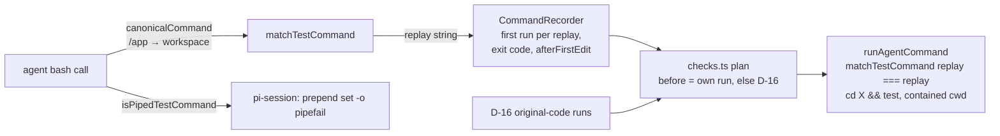

# Brainstorm: agent checks recognise test commands inside chains and filters

## Problem / opportunity

AgentX's check (spec 051) reruns only a test command the agent ran as a **simple command**:
`[cd <dir> &&] [NAME=v …] [timeout N] <runner> <args>`, optionally followed by `2>&1` and
`| tail -N` (P-6, D-14, D-15). Sonnet 5.5 rarely writes that shape. In batch `744df9ec`
(#297, 30 tasks) the agent ran tests 29 times in 12 runs, the matcher recognised 1 of them,
and 29 of 30 runs ended `not_verified`. So on Sonnet 5.5 the check is effectively off.

The misses fall into three shapes (counts overlap):

| Shape | Misses | Example |
|---|---|---|
| `cd <dir>; <test>` | 18 | `cd /app; QT_QPA_PLATFORM=offscreen python -m pytest tests/unit/browser/webengine -q 2>&1 \| tail -4` |
| filter other than `tail` | 17 | `python -m pytest openlibrary/tests/solr -q -x 2>&1 \| grep -E "^E" \| head` |
| test chained with other commands | 24 | `go build ./... && go test ./scanner ./models 2>&1 \| tail -20` |

## Context & constraints

Where the matcher is used today, and what each use relies on:



- **The replay is the security boundary, not the recognition.** `runAgentCommand` replays
  only a string the matcher maps to itself (`cd <safe path> && <test>`), in a contained
  directory. Whatever we accept from the agent's text, the replay stays that shape.
- **The before result.** `RecordedCommand.exitCode` from the agent's first run becomes the
  before unless the run came after an edit (`afterFirstEdit`) or has no exit code; then D-16
  measures it on the original code. A chain's exit code is the last command's, and a
  `head`/`grep` filter can cut the test short or mask its status — so for those shapes the
  agent's own run must never be a before. D-16 makes that cheap: the before is measured.
- **Overlap and workspace change** (Ruling E, G). The recorder treats a bash call as "may
  change the workspace" only when it is *not* a test command. A chain like
  `sed -i … && pytest` is both. It must count as may-change.
- **Path mapping.** `workspaceRelativeCommand` / `testbedRelativeCommand` rewrite only a
  *leading* `cd <container folder> &&`. `cd /app; …` and a `cd` later in a chain are not
  rewritten today, so they would fail the matcher's safe-path rule.
- **pipefail** is prepended only for `isPipedTestCommand` (simple test + `| tail`). Nothing
  here needs it widened: no new shape counts as a before.
- Budget: a round has 30 minutes and the report at most 64 entries. A chain with several
  test parts adds several checks.
- Constitution V: matcher behaviour needs behavioural (table) tests; no paid runs in
  development.

## Ideas & options

- **Option A — normalise `cd X;` to `cd X &&` only.** Cheap, fixes 4 misses outright. Leaves
  most of the gap. Worth doing, but not enough on its own.
- **Option B — a small top-level shell splitter, then match each part.** Tokenise the
  command once (quotes, the existing character rules), split at top-level `&&`, `||`, `;`,
  and within a part at `|`. For each part: a `cd <path>` updates the running directory
  (paths compose: `cd a && cd b` → `a/b`); a test command (current rules) becomes a replay
  `cd <dir> && <test>`; a read-only filter after it is dropped. Refuse the whole command on
  anything the splitter does not understand: subshells, `$(`, backticks, `&`, redirection
  to a file, heredocs, `git stash`. **Carry forward.**
- **Option C — a real shell parser dependency** (e.g. `bash-parser`, `shell-quote`). More
  shapes for free, but a new dependency on the security path, and the refusals become
  "whatever the parser does". Minimalism ladder says no: the grammar we need is tiny, and
  the existing `shellWords` already does the hard part. **Rejected.**
- **Option D — tell the agent to run tests on their own** (preamble). Out of scope per the
  ticket: it makes the check depend on the model following a style rule. **Rejected.**

Sub-options inside B:

- **Filters: allowlist or anything?** The replay drops the filter, so the filter is never
  executed by AgentX. But a filter like `| tee out.txt` or `| xargs rm` changes the
  workspace during the agent's run. Leaning: an allowlist of read-only filters (`tail`,
  `head`, `grep`/`egrep`, `sed` without `-i`, `cut`, `sort`, `uniq`, `wc`, `cat`), any
  arguments that tokenise (quoted patterns allowed). Anything else makes the part unknown.
- **Non-test parts: allowlist or anything?** `go build`, `go vet`, `echo`, `ls` appear around
  tests. Since the replay drops them, accepting any tokenisable command is safe for the
  replay. The risk is the environment: `export X=1; pytest`, `source venv/bin/activate &&
  pytest`, `pushd`, `set -e` change what the test sees, so replaying the bare test would
  measure a different thing. Leaning: accept any other simple command, but refuse the whole
  command when a part before the test is an environment changer (`export`, `source`, `.`,
  `set`, `unset`, `alias`, `pushd`, `popd`, `shopt`, `ulimit`, `umask`).
- **Several test parts in one command** (`pytest a && pytest b`). Leaning: each is its own
  check, deduplicated by replay string as today.

## Sketches & notes

What the new entry point would return (shape only):

```ts
// Each test inside `command`, as the replay AgentX would run, and whether the agent's own
// run can serve as the before (only the simple shapes accepted today).
function testCommandsIn(command: string): { replay: string; ownRunIsBefore: boolean }[];
```

`matchTestCommand` stays the replay validator (`replay === matchTestCommand(replay)` in
`runAgentCommand`), so the replay boundary does not move.

The recorder records each replay; when `ownRunIsBefore` is false the run's `exitCode` is
stored as unknown, so `checks.ts` takes D-16's measured before. A command that holds a test
and anything else is `mayChange` for overlap.

Path mapping moves from "rewrite a leading `cd … &&`" to "map each `cd` target", e.g.
`canonicalCommand` becomes a `canonicalCdPath(path)` the splitter calls per `cd`.

Cases from the ticket to use as contract-table rows:

| Agent command | Replay(s) | Own run is before? |
|---|---|---|
| `cd /app; QUTE_QT_WRAPPER=PyQt6 python -m pytest tests/unit/misc/test_guiprocess.py -q 2>&1\|tail -8` | `QUTE_QT_WRAPPER=PyQt6 python -m pytest tests/unit/misc/test_guiprocess.py -q` (`/app` maps to the root, so the `cd` drops, as today) | yes (open question 1) |
| `python -m pytest openlibrary/tests/solr -q -x 2>&1 \| grep -E "^E" \| head` | `python -m pytest openlibrary/tests/solr -q -x` | no |
| `go build ./... && go test ./scanner ./models 2>&1 \| tail -20` | `go test ./scanner ./models` | no |
| `go test ./internal/ext/... 2>&1 \| tail -20; go vet ./internal/...` | `go test ./internal/ext/...` | no |
| `git stash && pytest; git stash pop` | — (refused) | — |
| `export X=1; pytest` | — (refused) | — |

## Open questions

1. **Is `cd X; <test>` (nothing else in it) a simple command whose own run counts as a
   before, exactly like `cd X && <test>`?** The ticket's point 1 says "same command for the
   matcher". The difference: if `cd` fails, `;` still runs the test from the wrong
   directory. Leaning: yes, count it — the cd target is checked to exist inside the workspace
   when replayed, and a failing `cd` in the agent's shell almost always means a typo the
   agent sees immediately.
2. **Filters and other chain parts: allowlist, or "anything that tokenises"?** Leaning as in
   Options above: read-only allowlist for filters; anything for other parts except
   environment changers, which refuse the command.
3. **Can the 29 commands from batch `744df9ec` be attached to the ticket (or committed as a
   fixture)?** They would make the contract table complete and let verification re-run the
   replay count the ticket describes (target: most of the 28 misses recognised, every
   refusal justified).
4. **`git stash`:** refuse the whole command whenever any part is `git stash …` (simplest),
   rather than only the parts between `stash` and `stash pop`. Leaning: refuse the whole.

## Leaning / working hypothesis

Option B. One new pure function in `packages/contracts/src/checks.ts` that splits a command
at top-level `&&`, `||`, `;` and `|`, tracks `cd`, and returns every test it finds as a
`cd <dir> && <test>` replay, plus whether the agent's run is a usable before (only today's
simple shapes, plus `cd X;`). `matchTestCommand` keeps defining the replay shape and
`runAgentCommand` keeps validating against it. The recorder records several replays per
call, marks non-simple runs' exit codes as unknown so D-16 supplies the before, and treats
any command with non-test parts as may-change. Path mapping applies to every `cd` target.

## Hand-off → requirements

Carries forward: the three shapes as user stories; EARS criteria for each accepted shape,
each refusal (subshell, `$(`, backticks, `&`, file redirection, heredoc, `git stash`,
environment changers, unknown filters), the before-result rule, the may-change rule, path
mapping of every `cd`, and the unchanged replay boundary. Security considerations: the
agent's command text is untrusted; the replay shape and contained cwd stay the boundary.

## Review comments
