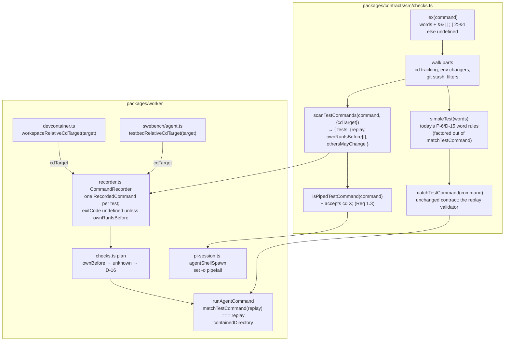
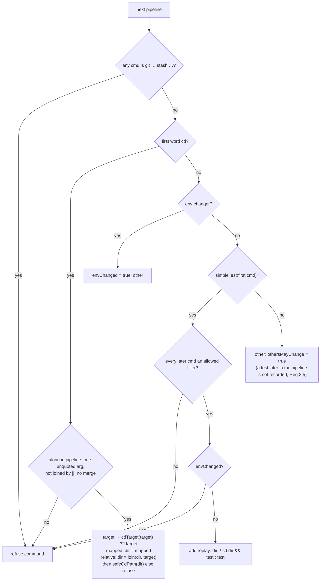

# Design: agent checks recognise test commands inside chains and filters

> Derives from the approved [`requirements.md`](requirements.md). Reviewed together with
> `testing-plan.md` at the `design-approval` gate.

## Overview

The design adds one pure function, `scanTestCommands`, in `packages/contracts/src/checks.ts`. It
lexes the agent's command with today's character and quoting rules plus four operators (`&&`,
`||`, `;`, `|`) and the `2>&1` token. It then walks the parts and returns every test command it
finds, each as a replay and a flag saying whether the agent's own run can be its before. The
recorder calls it in place of `matchTestCommand`. Everything downstream is unchanged:
`checks.ts` already takes D-16's measured before whenever a run's own before is `unknown`, and
`runAgentCommand` still runs only what `matchTestCommand` maps to itself.

What it costs: a small hand-written lexer on the security path, about 150 lines. A parser
dependency was rejected in the brainstorm (Option C). The lexer is deliberately narrower than
bash, and anything outside it fails closed with no replay.

## Architecture



The arrows into `RUN` are the trust boundary. This item changes what reaches it, not what it
accepts.

## Components & interfaces

### `scanTestCommands` (new, contracts)

```ts
export interface FoundTestCommand {
  /** `cd <dir> && <test>`, or `<test>` from the root: always a string matchTestCommand maps to itself. */
  replay: string;
  /** True only for today's simple shape and `cd <dir>; <test>` (Req 1, 2.3, 3.3). */
  ownRunIsBefore: boolean;
}
export interface TestCommandScan {
  tests: FoundTestCommand[];
  /** True when any part or pipeline command is neither a test, a `cd`, nor an allowed filter (Req 5.1). */
  othersMayChange: boolean;
}
export interface ScanOptions {
  /**
   * Maps an absolute `cd` target the agent's shell knows (a container or host folder) to a workspace-relative
   * path, `""` for the root; undefined leaves the target as written (Req 6).
   */
  cdTarget?: (target: string) => string | undefined;
}
export function scanTestCommands(command: string, options?: ScanOptions): TestCommandScan;
```

A refused command returns `{ tests: [], othersMayChange: true }`. That is the same view the
recorder has of a non-test bash call today.

**Lexer.** It reuses `shellWords`' quoting and is extended to emit tokens:

| Input | Token |
|---|---|
| unquoted run of `UNQUOTED` characters, quoted text under `QUOTED` rules | word (`raw`, `value`, source span) |
| `&&`, `\|\|`, `;`, `\|` | operator |
| the word `2` followed directly by `>&1` | `merge` (only as a command's last token) |
| space | separator |
| anything else: `&` alone, `\|&`, `<`, `>`, `(`, `)`, `{`, `}`, `$`, backtick, `\`, newline, CR, tab, other control characters, `*`, `?`, `[`, `!`, `~`, `#` | **refuse the whole command** |

The `UNQUOTED` set already excludes the characters in the last row, so the change is that `&`,
`|`, `;`, `>` and `<` are now looked at before the command is refused. Quoted operators stay
literal (abuse case 2). An unquoted backslash still refuses (abuse case 3).

**Grammar.** `command := pipeline (op pipeline)* [";"]`, with `pipeline := cmd ("|" cmd)*` and
`cmd := word+ [merge]`. An empty part (`;;`, `&& ;`, leading operator) refuses. A trailing `;` is
allowed.

**Walk.** The walk goes left to right with `dir` (workspace-relative, `""` = root) and
`envChanged = false`:



- **Environment changers (Req 4.3):** a first word in `export`, `source`, `.`, `set`, `unset`,
  `alias`, `pushd`, `popd`, `shopt`, `ulimit`, `umask`, `eval`, `exec`, `declare`, `typeset`,
  `readonly`, or a cmd whose words are all `NAME=value`. One of these before a test refuses the
  command. One after the last test is just "other".
- **Allowed filters (Req 3.2):** a first word in `tail`, `head`, `grep`, `egrep`, `sed`, `cut`,
  `sort`, `uniq`, `wc`, `cat`. `sed` is refused when any word is `--in-place`, starts with
  `--in-place=`, or is a short-option cluster (`-…`, not `--…`) containing `i`. `-n` and `-e`
  are fine, `-ni` is not.
- **`git stash` (Req 4.2):** any cmd whose first word is `git` and any later word is `stash`. This
  also catches `git -C x stash` and fails closed on `git log --grep stash`.
- **Replay text:** `test` is the source slice from the test's first word to its last word,
  excluding `merge`. This keeps today's internal spacing, so every replay in today's table
  stays byte-identical (Req 7.3).
- **Composition (Req 2.2, 6):** a target `cdTarget` maps is root-relative and replaces `dir`.
  A target it does not map composes with `dir` (`a` + `b` → `a/b`, a trailing `/` on `dir`
  dropped first). `safeCdPath` then applies to the result: an unmapped absolute target, `~…`,
  `-…` or a `..` segment refuses (Req 2.6, abuse case 4).
- **Deduplication (Req 2.4):** a replay already in `tests` is not added again. If any
  occurrence of a replay is not own-run eligible, the entry isn't either.

**`ownRunIsBefore`** is true exactly when the whole command has one of these shapes:

- `[cd X && | cd X ; ] simpleTest [merge] [| tail <-N | -n N | -nN>]`, with nothing else and
  no trailing `;`. A `cd X` that maps to the root still counts (`cd /app && pytest` replays as
  `pytest`, as today).

That is today's P-6/D-14 set plus the `;` form (Req 1.2). Every other found test has
`ownRunIsBefore: false`.

### `simpleTest` and `matchTestCommand` (refactor, contracts)

The word checks in today's `matchTestCommand`, after the `cd` split, move into a private
`simpleTest(words)`: refused arguments, `--watch`, workspace escapes, assignments, `timeout`, the
`TEST_HEADS` prefix. `matchTestCommand` keeps its exact signature and behaviour, and is the
replay validator in `runAgentCommand` (Req 7.1). Its contract table is unchanged.

### `isPipedTestCommand` (amended, contracts)

`isPipedTestCommand(command)` is true when `scanTestCommands(command, { cdTarget: () => "" })`
finds exactly one test, with `ownRunIsBefore`, whose command ends in `| tail -N`. The
`() => ""` mapper treats every `cd` target as the root, which keeps today's rule that the target
is not checked for pipefail. It also makes the function agree with the recorder by
construction: a run the recorder may take as a before is exactly a run that got pipefail
(Req 1.3, D-14).

### `CommandRecorder` (changed, worker)

- `CommandRecorderOptions.canonicalCommand?: (command) => string` becomes
  `cdTarget?: (target) => string | undefined`, passed through to `scanTestCommands`.
- `bashReplay` becomes `bashScan(event)`, which returns a `TestCommandScan`.
- `observeCall`: `test = scan.tests.length > 0`. `mayChange = (bash && (!test ||
  scan.othersMayChange)) || edit || write` (Req 5.1). Both overlap branches run when a call is
  both. Its own runs have no own before anyway, since `othersMayChange` implies a shape that is
  not simple.
- `observe`: one `#record` per found test, in order (Req 5.2). The command, output and
  `afterFirstEdit` are shared. `exitCode` is the run's exit code when `ownRunIsBefore`, else
  `undefined`, which `ownBefore` already reads as `unknown`. So D-16 measures it (Req 2.3), and
  the existing "unknown yields to a later known run" rule in `#record` still lets a later simple
  run supply the before.
- The fingerprint path (Ruling E) is unchanged for any call with `test` true (Req 5.3).

### Path mapping (changed, worker)

`workspaceRelativeCommand(command, paths, root)` is replaced by
`workspaceRelativeCdTarget(target, paths, root): string | undefined`, and `testbedRelativeCommand`
by `testbedRelativeCdTarget`. The rule is the same as today's: the target equals the container
or host folder, or starts with it plus `/`. The result is `relative(root, hostFolder)` plus the
rest, and a host folder outside `root` maps nothing. It now applies to every `cd` the scan meets
rather than only a leading `cd … &&` (Req 6.1, 6.2). `run-task.ts` and `swebench/agent.ts` pass
it as `cdTarget`. The stored command stays the agent's text (Req 6.3).

### Spec 051 (docs)

Spec 051 gets a new decision, D-19 (2026-10-04, #299, amends P-6, D-11 and D-14), worded from
Requirements 1 to 7 with batch `744df9ec`'s numbers (Req 8.1). The preamble is untouched
(Req 8.2).

### Requirement → component

| Requirement | Component |
|---|---|
| 1.1, 1.2 | `scanTestCommands` (`;` after a lone `cd`; `ownRunIsBefore`) |
| 1.3 | `isPipedTestCommand` via the scan |
| 2.1–2.6 | `scanTestCommands` walk, composition, dedupe |
| 2.7 | unchanged `MAX_CHECKS` slice in `checks.ts` and the round budget |
| 3.1–3.5 | `scanTestCommands` filters |
| 4.1–4.5 | lexer + walk refusals |
| 5.1–5.3 | `CommandRecorder` |
| 6.1–6.3 | `workspaceRelativeCdTarget`, `testbedRelativeCdTarget`, `cdTarget` option |
| 7.1–7.4 | `matchTestCommand` unchanged; `runAgentCommand` unchanged; contract tables |
| 8.1, 8.2 | spec 051 D-19 |

## UI/UX design

N/A. This is worker-internal behaviour with no user-facing surface. The check report and the
Slack wording only show more checks; their formats don't change.

## Data models

No schema changes. `RecordedCommand` keeps its fields. A run whose own exit code cannot serve
stores `exitCode: undefined`. `CheckEntry` and `CheckReport` are unchanged, and a chained test
shows as an ordinary `agent:<n>` entry whose before is D-16's measurement.

## Error handling

`scanTestCommands` is total: it never throws, and any input it cannot handle yields no tests.
The recorder's error paths (fingerprint failure, unseen tool_call) are unchanged. A replay that
fails `matchTestCommand` at run time still throws `CheckNotRunError` and is reported `not_run`.
That would be a bug in the scan, and a contract test asserts it cannot happen for any scan
output in the tables. No new log lines.

## Security design

- **AuthN/AuthZ:** unchanged. Checks run inside the worker for the task's own workspace. No
  identity is involved in recognition.
- **Input validation & injection surfaces:** the one untrusted ingress is the agent's bash
  command text, so this is a **command-injection surface**. It is constrained twice:
  1. at recognition, by the lexer's allowlist (today's `UNQUOTED` and `QUOTED` rules, plus four
     operators and `2>&1`), with each test's words passing `simpleTest`;
  2. at replay, by `matchTestCommand(replay) === replay` and `containedDirectory`'s realpath
     containment, both unchanged.

  The replay is built only from a validated test's source slice and a `safeCdPath`-checked
  directory, so no text from another part can reach it. **Path injection:** `cd` targets go
  through the mapper, then `safeCdPath` on the *composed* path, then `containedDirectory` at
  replay.
- **Secrets handling:** none involved. The replay label and output are redacted as today
  (`redactText`, `redactedTail`).
- **Least privilege:** unchanged. A replay runs in the agent's own shell environment (the
  devcontainer or task container), with the AgentX git identity, as today.
- **Fail-closed behaviour:** any lexer surprise, unknown filter, environment changer before a
  test, `git stash`, `||` next to `cd`, or unsafe composed path gives no replay. A before that
  D-16 cannot measure stays `unknown` and is never `passed`.
- **Abuse-case coverage:**

  | Abuse case (requirements) | Mechanism | Negative test |
  |---|---|---|
  | 1 `pytest; rm -rf <path>` | replay = test's source slice only | scan table: replay `pytest`, `othersMayChange` |
  | 2 quoted `;` / `&&` | lexer keeps quoted text in one word | scan table |
  | 3 unquoted `\` | lexer refuses | scan table |
  | 4 `cd a && cd ../..`, `cd /etc` | `safeCdPath` on the composed dir | scan table |
  | 5 `pytest \|\| true` | `ownRunIsBefore: false` → `exitCode` undefined | scan table + recorder unit test |
  | 6 `git stash && pytest; git stash pop` | walk refuses | scan table |
  | 7 `sed -i … && pytest` | `othersMayChange` → recorder `mayChange`; no own before | recorder unit test (overlap) |
  | 8 `pytest \| tee`, `\| xargs rm` | filter allowlist | scan table |
  | 9 `export X=1; pytest`, `X=1; pytest` | env changer before test refuses | scan table |

## Testing strategy

Recognition is a pure function, so most of the proof is contract tables in
`tests/contract/agent-checks.test.ts`. One table maps each command to its expected
`{replay, ownRunIsBefore}` list: every command quoted in #299, the nine rows of Requirement 7.4,
the abuse cases and the refusals in Requirement 4. One property-style test feeds every existing
`matchTestCommand` table row through the scan: rows that replay today must give exactly one
test with the same replay and `ownRunIsBefore: true`, and refused rows must stay refused,
except the 7.4 rows (Req 7.3, 7.4). Another asserts `matchTestCommand(replay) === replay` for
every replay any table produces (Req 7.1).

`tests/unit/worker-command-recorder.test.ts` covers several runs per call, `exitCode` withheld
for chained runs, and the overlap rule for `sed -i … && pytest`. The path-mapping unit tests
cover every-`cd` mapping. `tests/integration/agent-shell-pipefail.test.ts` covers the
`cd X; … | tail` pipefail. One scripted-model integration scenario, *"Scenario: a test run
inside a chain is rerun, with its before measured on the original code"*, sits in the
existing worker verification suite. The test matrix, environment and evidence belong in
`testing-plan.md`.

## Trade-offs & decisions

- **Hand-written lexer, not a parser dependency.** About 150 lines that we own, and their
  refusals are explicit. The cost is that some valid bash goes unrecognised (single-quoted
  backslashes, `$VAR` in filter patterns). Recorded as spec 051 D-19 rather than a separate
  `docs/decisions/` entry, because spec 051 is where this rule's history lives.
- **`matchTestCommand` stays the validator.** Recognition is wider and execution isn't. Two
  functions, one boundary.
- **A chained run's exit code is dropped at the recorder**, not inferred. D-16 already measures
  the before, so the recorder does not try to recover the test's own status from a chain.
- **`cdTarget` replaces `canonicalCommand`.** A string rewrite of the whole command could not
  map a `cd` after `;` or later in a chain, and per-target mapping is the smaller interface. The
  rewritten-command function had no other callers.
- **`cd a&&pytest` (no spaces) now replays** as `cd a && pytest` with an own-run before. It is
  not in today's table, and it is the same command.
- **Not done:** environment changers are not carried into the replay (e.g. turning
  `export X=1; pytest` into `X=1 pytest`). The requirements chose refusal.

## Open questions

None.

## Review comments

### 2026-10-04 — approved

**@ps06756** wrote:

approved
