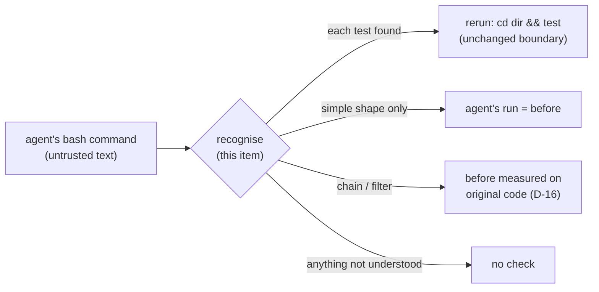

# Requirements: agent checks recognise test commands inside chains and filters

## Introduction

AgentX's check (spec 051) reruns a test only when the agent ran it as a simple command. Claude
Sonnet 5.5 rarely does. In batch `744df9ec` ([#297](https://github.com/PrepLabsAI/AgentX/issues/297))
the matcher recognised 1 of the agent's 29 test runs, and 29 of 30 runs ended `not_verified`.
This work item ([#299](https://github.com/PrepLabsAI/AgentX/issues/299)) makes the check find
tests inside three shapes Sonnet 5.5 uses: `cd <dir>; <test>`, a test piped into a filter other
than `tail`, and a test chained with other commands.

The fix widens what AgentX **recognises**. It does not widen what AgentX **runs**: the rerun is
still `[cd <dir> && ]<simple test command>`, validated as today. And because the agent's own
run of a chain or a filtered test does not report the test's status, that run never counts as
the before result. AgentX measures the before on the original code instead (D-16).

The direction, the options rejected and the four resolved questions are in
[`brainstorm.md`](brainstorm.md).

## Glossary

- **Simple test command:** today's P-6 shape after D-14 and D-15: optional `NAME=value`
  assignments, an optional `timeout <n>`, then a listed runner with arguments that pass the
  current rules (character set, literal quoting, no refused arguments such as `-u` or
  `--watch`, no path outside the workspace).
- **Part:** one command between top-level `&&`, `||` or `;`, outside quotes.
- **Filter:** a command after a top-level `|` that follows the test in the same part.
- **Replay:** the command AgentX reruns, `cd <dir> && <simple test command>` or the simple test
  command alone.
- **Own-run before:** the agent's own run of a command used as its before result (FR-003).

## Requirements

### Requirement 1: `cd <dir>; <test>` reads as `cd <dir> && <test>`

**User story:** As an AgentX operator, I want `cd /app; pytest …` checked the same as
`cd /app && pytest …`, so that a model's habit of writing `;` does not switch the check off.

#### Acceptance criteria (EARS)

1. WHEN the agent runs `cd <dir>; <simple test command>`, optionally followed by `2>&1` and
   `| tail -N`, THEN the system SHALL record the same replay it records for
   `cd <dir> && <simple test command>`.
2. WHEN the agent runs a command of the shape in criterion 1 THEN the system SHALL treat the
   agent's run as an own-run before under the same rules as `cd <dir> && <test>` (FR-003, D-14).
3. WHEN the agent runs a command of the shape in criterion 1 that ends in `| tail -N` THEN the
   system SHALL run it in the agent's shell with `set -o pipefail`, as D-14 does for
   `cd <dir> && <test> | tail -N`.

### Requirement 2: tests inside chains

**User story:** As an AgentX operator, I want a test the agent ran as one part of a chain
checked, so that `go build ./... && go test ./scanner` still verifies the work.

#### Acceptance criteria (EARS)

1. WHEN the agent runs a command whose top-level parts include one or more simple test
   commands THEN the system SHALL record one replay for each of them.
2. WHEN a test part follows one or more `cd <dir>` parts THEN the system SHALL replay it from the
   directory those `cd` parts lead to, composing relative paths (`cd a && cd b && pytest`
   replays as `cd a/b && pytest`).
3. WHEN a recorded replay comes from a command that is not of the shapes in Requirement 1 or in
   today's P-6 THEN the system SHALL NOT use the agent's run as an own-run before for it, and
   SHALL take its before from D-16's measurement on the original code (`unknown` when D-16
   could not measure one).
4. WHEN two parts of one command yield the same replay THEN the system SHALL record it once.
5. IF a `cd` part is joined to a neighbouring part by `||` THEN the system SHALL record no
   replay from that command.
6. IF a `cd` part has no target, or a target that is `-`, absolute (after path mapping),
   home-relative, or contains a `..` segment, THEN the system SHALL record no replay from that
   command.
7. WHEN the agent runs a test as a part of a chain THEN the system SHALL apply the existing
   per-report limit of 64 checks and the 30-minute round budget unchanged.

### Requirement 3: tests piped into filters

**User story:** As an AgentX operator, I want `pytest … 2>&1 | grep -E "^E" | head` checked, so
that trimming the output does not hide the test from the check.

#### Acceptance criteria (EARS)

1. WHEN a simple test command is the first command of a pipeline whose other commands are all
   allowed filters THEN the system SHALL record the test without `2>&1` and without the
   pipeline as its replay.
2. The allowed filters SHALL be `tail`, `head`, `grep`, `egrep`, `sed`, `cut`, `sort`, `uniq`,
   `wc` and `cat`, with any arguments that tokenise under the current quoting rules, except
   `sed` with an in-place option (`-i`, `--in-place`, or a combined short option containing `i`).
3. WHEN a test is followed by a filter other than a single trailing `| tail -N` THEN the system
   SHALL NOT use the agent's run as an own-run before.
4. IF any command after the test in its pipeline is not an allowed filter THEN the system SHALL
   record no replay from that command.
5. IF a simple test command is not the first command of its pipeline THEN the system SHALL NOT
   record it.

### Requirement 4: what stays refused

**User story:** As an AgentX operator, I want shapes whose test result the replay cannot
reproduce, or whose boundaries the matcher cannot be sure of, to stay unchecked, so that a
check never reports on a different test from the one the agent ran.

#### Acceptance criteria (EARS)

1. IF the command contains a subshell or group (`(`, `)`, `{`, `}` outside quotes), a command
   substitution (`$(` or a backtick), a background `&`, a heredoc (`<<`), any redirection
   other than `2>&1` (on any part), or a newline, carriage return, tab or other control character
   outside quotes, THEN the system SHALL record no replay from that command.
2. IF any part of the command runs `git stash` (any subcommand) THEN the system SHALL record no
   replay from that command.
3. IF a part before a test part changes the shell's environment THEN the system SHALL record no
   replay from that command. Environment changers SHALL include at least `export`, `source`, `.`,
   `set`, `unset`, `alias`, `pushd`, `popd`, `shopt`, `ulimit`, `umask`, `eval`, `exec`,
   `declare`, `typeset`, `readonly` and a part that is only `NAME=value` assignments.
4. IF the command cannot be split into parts with every quote closed and every unquoted
   character within the current allowed set or the operators `&&`, `||`, `;`, `|`, THEN the
   system SHALL record no replay from that command.
5. WHEN a part is not a test, a `cd`, a filter or an environment changer THEN the system SHALL
   ignore it for recognition (it is neither replayed nor a reason to refuse), subject to
   criteria 1 to 4.

### Requirement 5: the recorder's view of chained runs

**User story:** As an AgentX operator, I want a chained command that also edits files to count as
an edit, so that a before result is never taken from code the agent had already changed.

#### Acceptance criteria (EARS)

1. WHEN a bash call yields at least one replay and holds any part or filter that is not a test
   THEN the system SHALL treat the call as one that may change the workspace for the overlap
   rule (Ruling G), as it treats a bash call that is not a test command today.
2. WHEN a bash call yields several replays THEN the system SHALL record each with the call's exit
   code and output, and with own-run-before eligibility decided per Requirements 1 to 3.
3. WHILE the workspace fingerprint rule (Ruling E) applies, the system SHALL keep applying it to
   every replay a call yields.

### Requirement 6: container and host paths in every `cd`

**User story:** As an AgentX operator, I want `cd /app; …` and a `cd /testbed/x` later in a chain
mapped to the workspace, so that eval and devcontainer runs are recognised as host runs are.

#### Acceptance criteria (EARS)

1. WHEN a `cd` target in any part is the container folder or the host folder, or a path under
   one, THEN the system SHALL map it to the workspace-relative path the leading `cd … &&`
   mapping (Ruling X, D-15) gives today.
2. WHEN a mapped `cd` target is the workspace root THEN the system SHALL omit that `cd` from the
   replay, as today.
3. The stored command SHALL remain the agent's own text; only the matcher's input is mapped, as
   today.

### Requirement 7: the replay boundary does not move

**User story:** As an AgentX operator, I want the set of commands AgentX may run unchanged, so
that recognising more shapes adds no new way to run something that is not a test.

#### Acceptance criteria (EARS)

1. WHEN AgentX replays an agent command THEN the system SHALL run only a string that today's
   simple-test validator (`matchTestCommand(replay) === replay`) accepts.
2. WHEN AgentX replays an agent command THEN the system SHALL run it in the directory checked by
   today's containment rule (`containedDirectory`), and nowhere else.
3. Every command in today's contract table that replays SHALL replay to the same string.
4. Every command in today's contract table that is refused SHALL stay refused, except these,
   which this item deliberately changes:

   | Today refused | Replay after this item | Own-run before |
   |---|---|---|
   | `pytest \| tail` | `pytest` | no |
   | `pytest \| tail -f` | `pytest` | no |
   | `pytest \| head -5` | `pytest` | no |
   | `pytest \| grep x` | `pytest` | no |
   | `pytest \| tail -5 \| grep x` | `pytest` | no |
   | `npm test; echo x \| tail -5` | `npm test` | no |
   | `npm test; echo done` | `npm test` | no |
   | `npm test \|\| true` | `npm test` | no |
   | `cd a && cd b && pytest` | `cd a/b && pytest` | no |

### Requirement 8: the change is recorded in spec 051

**User story:** As a maintainer, I want spec 051 to state the new recognition rule, so that P-6,
D-11 and D-14 are not read as current when they no longer are.

#### Acceptance criteria (EARS)

1. WHEN this item is delivered THEN `specs/051-agent-verification/spec.md` SHALL carry a new
   decision that amends P-6, D-11 and D-14, citing #299 and batch `744df9ec`.
2. The preamble and its version SHALL stay unchanged (`AGENTX_PREAMBLE_VERSION` "4").

## Non-functional requirements

- **No new dependency.** Recognition stays a pure function in `packages/contracts`, extending
  the existing tokeniser rather than adding a shell parser (rejected in the brainstorm, Option C).
- **Cost.** Recognition is linear in the command's length; the agent's commands are short.
  More recognised tests mean more reruns, bounded by the existing 64-check and 30-minute limits.
- **Observability.** No new log lines. The check report already lists each check and its
  before; a chained run shows its before as measured or `unknown`, as D-16 already reports.
- **Verification.** Contract-table tests cover every accepted and refused shape, including the
  commands quoted in #299. No paid runs (spec 051 D-5).

## Security considerations

- **Actors & trust:** the coding agent's bash commands are **untrusted**: model output that
  repository content or task text can steer (prompt injection). The worker, the recorder and the
  replay runner are trusted.
- **Trust boundaries & data:** the boundary is where AgentX turns the agent's text into a command
  it runs itself at settle (`runAgentCommand`). This item changes only what reaches that boundary
  as a candidate; the boundary's own checks (Requirement 7) stay as they are. No secrets, tokens
  or personal data are stored or moved. Replay output is redacted as today.
- **Abuse cases (EARS):**
  1. WHEN the agent runs `pytest; rm -rf <path>` THEN the system SHALL replay `pytest` only.
  2. WHEN the agent runs `pytest "a;b"` or `pytest 'x && y'` THEN the system SHALL NOT split at the
     quoted operator, and SHALL treat the quoted text as one argument under the current quoting
     rules.
  3. WHEN the agent runs `pytest a\;b` or a command with any unquoted backslash THEN the system
     SHALL record no replay.
  4. WHEN the agent runs `cd a && cd ../.. && pytest` or `cd a; cd /etc; pytest` THEN the system
     SHALL record no replay.
  5. WHEN the agent runs `pytest || true` or `pytest; true` THEN the system SHALL NOT take the
     agent's run (exit code 0) as a passing before result.
  6. WHEN the agent runs `git stash && pytest; git stash pop` THEN the system SHALL record no
     replay, so a run against the original code is never taken as the agent's run of its change.
  7. WHEN the agent runs `sed -i s/x/y/ src/a.py && pytest` THEN the system SHALL count the call as
     one that may change the workspace, and SHALL NOT take its run as a before result.
  8. WHEN the agent runs `pytest | tee out.txt` or `pytest | xargs rm` THEN the system SHALL record
     no replay.
  9. WHEN the agent runs `export PYTHONPATH=x; pytest` or `PYTHONPATH=x; pytest` THEN the system
     SHALL record no replay, so a rerun never tests under a different environment and calls it
     the agent's test.
- **Fail closed:** any command the splitter cannot fully tokenise, or any shape not listed as
  accepted, yields no replay. A replay the validator does not accept is not run (defence in
  depth, unchanged). A missing or failed D-16 measurement leaves the before `unknown`, never
  `passed`.

## Out of scope

- Telling the agent in the preamble to run tests as separate commands (rejected in #299: the
  check would depend on the model following a style rule).
- Detecting test edits ([#294](https://github.com/PrepLabsAI/AgentX/issues/294)).
- Re-running batch `744df9ec`'s replay count: the 29 commands were not supplied (brainstorm,
  question 3). The ticket's quoted commands are the contract cases.
- Multi-line commands, heredocs and subshells (Requirement 4 keeps them refused).
- New test runners.

## Open questions

None open. The four brainstorm questions were answered "defaults are fine"
([comment](https://github.com/PrepLabsAI/AgentX/issues/299#issuecomment-5983296084)).
Requirement 4.3 extends the agreed list of environment changers with `eval`, `exec`, `declare`,
`typeset`, `readonly` and bare `NAME=value` parts. They change the environment the same way, and
the requirements gate is where to object.

## Review comments
