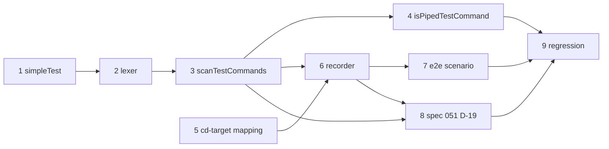

# Tasks: agent checks recognise test commands inside chains and filters

> Derived from the approved [`requirements.md`](requirements.md), [`design.md`](design.md) and
> [`testing-plan.md`](testing-plan.md). Every task is test-first: the named test goes red, then
> green, and the commit carrying the task says so.

## Task list

- [x] 1. Factor `simpleTest(words)` out of `matchTestCommand`
  - Move the per-word rules (refused arguments, `--watch`, workspace escapes, assignments,
    `timeout`, `TEST_HEADS`) into a private helper. `matchTestCommand`'s behaviour stays
    byte-identical.
  - _Depends on:_ none
  - _Requirements:_ R7.1, R7.3
  - _Test:_ T3 — the existing `matchTestCommand` table in `tests/contract/agent-checks.test.ts`
    stays green (a pure refactor, so no red step; the table is the guard)
- [x] 2. Lexer: tokens for words, `&&`, `||`, `;`, `|`, `2>&1`, refusing everything else
  - Extend `shellWords` into a token lexer with source spans. Quoted operators stay inside
    words, and any character outside the design's lexer table refuses.
  - _Depends on:_ 1
  - _Requirements:_ R4.1, R4.4
  - _Test:_ T3/T8 — scan table rows for abuse cases 2 and 3, plus the R4.1 refusals (`(pytest)`,
    `{ pytest; }`, `pytest &`, `pytest <<EOF`, `pytest > out`, `pytest 2>/dev/null`, newline)
    (red→green, written with task 3's entry point)
- [x] 3. `scanTestCommands`: walk, `cd` tracking and composition, filters, environment changers,
  `git stash`, dedupe, `ownRunIsBefore`
  - Export `scanTestCommands`, `FoundTestCommand`, `TestCommandScan` and `ScanOptions` from
    contracts.
  - _Depends on:_ 2
  - _Requirements:_ R1.1, R1.2, R2.1–R2.6, R3.1–R3.5, R4.2, R4.3, R4.5, R6.1 (via `cdTarget`), R7.4
  - _Test:_ T3/T8 — the scan table (every #299 command, the R2/R3/R4 rows of the trace, abuse
    cases 1, 4, 5, 6, 8, 9), the "existing rows unchanged" property test (R7.3), the R7.4 table, and
    "every replay is a `matchTestCommand` fixpoint" (R7.1) (red→green)
- [x] 4. `isPipedTestCommand` on the scan, accepting `cd X; … | tail -N`
  - _Depends on:_ 3
  - _Requirements:_ R1.3
  - _Test:_ T3 — the `isPipedTestCommand` rows (the `cd /testbed;` case true, chains false; the
    existing rows unchanged), and T2 — `agent-shell-pipefail.test.ts`,
    `Scenario: the agent shell runs cd <dir>; <test> | tail with pipefail` (red→green)
- [x] 5. Per-`cd` path mapping: `workspaceRelativeCdTarget`, `testbedRelativeCdTarget`
  - Replace `workspaceRelativeCommand` and `testbedRelativeCommand`. Same folder rule; `""` for
    the root; a host folder outside the root maps nothing.
  - _Depends on:_ none
  - _Requirements:_ R6.1, R6.2
  - _Test:_ T1 — `tests/unit/devcontainer-cd-target.test.ts` (red→green)
- [x] 6. `CommandRecorder` on the scan: `cdTarget` option, one run per found test, `exitCode`
  withheld unless `ownRunIsBefore`, `mayChange` from `othersMayChange`. Wire `cdTarget` in
  `run-task.ts` and `swebench/agent.ts`.
  - _Depends on:_ 3, 5
  - _Requirements:_ R2.3, R5.1–R5.3, R6.3
  - _Test:_ T1/T8 — `tests/unit/worker-command-recorder.test.ts`: two runs from
    `pytest a; pytest b` with unknown exit codes; a later simple run supplies the before;
    abuse case 7 (`sed -i … && pytest` voids a batched simple call's before, either order);
    a chained call after a bash edit is `afterFirstEdit`; the existing recorder cases stay green
    (red→green)
- [x] 7. End-to-end scenario: a chained test is rerun with its before measured on the original code
  - Add a case to the D-16 suite in `tests/integration/worker-verification.test.ts`, with a
    Gherkin docstring.
  - _Depends on:_ 6
  - _Requirements:_ R2.1, R2.3, R5.2
  - _Test:_ T2 —
    `Scenario: a test run inside a chain is rerun, with its before measured on the original code`
    (red→green)
- [ ] 8. Spec 051 D-19
  - Add D-19 (2026-10-04, #299, amends P-6, D-11 and D-14) to `specs/051-agent-verification/spec.md`.
    The preamble is untouched.
  - _Depends on:_ 3, 6
  - _Requirements:_ R8.1, R8.2
  - _Test:_ R8.1 verification activity (diff read); T12 — the existing preamble version test
    keeps `"4"`
- [ ] 9. Whole-suite regression
  - _Depends on:_ 4, 6, 7, 8
  - _Requirements:_ R7.3, R8.2
  - _Test:_ T12 — `npm run build && npm test`, `npm run typecheck:all` (at baseline),
    `npm run lint`

## Dependency graph (DAG)

Tasks 1 and 5 can start in parallel. Everything lands in this repository (`PrepLabsAI/AgentX`),
in one pull request.

## Checkpoints

- After tasks 1–4: `npx vitest run tests/contract/agent-checks.test.ts` and
  `npx vitest run tests/integration/agent-shell-pipefail.test.ts`.
- After tasks 5–6: `npm run build`, then
  `npx vitest run tests/unit/worker-command-recorder.test.ts tests/unit/devcontainer-cd-target.test.ts tests/integration/worker-command-recorder-session.test.ts tests/integration/swebench-verification.test.ts`.
- After task 7: `npx vitest run tests/integration/worker-verification.test.ts`.
- Task 9 is the full gate. The `verification` node then executes `testing-plan.md`, and the
  review phases follow (self, critic, security gate in `evidence/security-review.md`).

## Review comments
