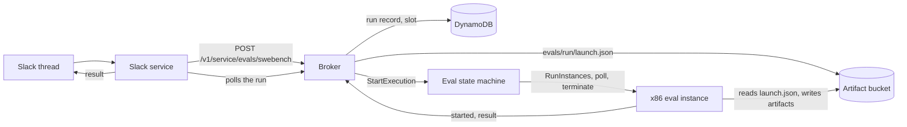

# SWE-bench runs from Slack

Spec 043. A member of an enabled channel scores the AgentX coding agent on one SWE-bench task:

```
@agentx eval swebench verified django__django-11099
@agentx eval swebench lite astropy__astropy-12907 model Fast
```

AgentX replies that the run started, and later posts whether the task was resolved, the hidden tests'
counts, why the agent stopped, how long it took, what it cost and where its artifacts are. `stop` in
the thread cancels the run. Up to `maxConcurrentEvals` runs (4 by default) run at once per deployment,
single runs and batch runs together; batches always leave one slot free for single runs (see
[Batches](#batches-spec-052)).

A run measures the coding agent: the worker's Pi session, tools, prompts and model. It does not use a
project workspace, devcontainer or pull request, and does not measure the Slack orchestrator.

### SWE-Bench Pro (spec 044)

`pro` names SWE-Bench Pro V2's 642 tasks and `pro-hard` its HARD-51 subset (tasks at least two of five
frontier model families failed). Their IDs look like `instance_NodeBB__NodeBB-<commit>-v<suffix>`; the
`instance_id` column of `ScaleAI/SWE-bench_Pro` on Hugging Face lists them.

```
@agentx eval swebench pro-hard instance_NodeBB__NodeBB-8168c6c40707478f71b8af60300830fe554c778c-vf2cf3cbd463b7ad942381f1c6d077626485a1e9e model Claude Sonnet 4.6
```

A Pro run differs from a SWE-bench run in four ways: the agent works from the task's `instruction.md` (PR
description, requirements and new interfaces); the repository is at `/app` (a few at `/testbed`); the
agent has Pro's 50-minute budget and a 400-call tool backstop; and the task's own Harbor verifier grades
the patch in a fresh container. The task's files come from `scaleapi/SWE-bench_Pro-os` at a pinned commit,
checked against its `SHA256SUMS`, and the hidden tests never enter the agent's container.

### SEC-bench patch tasks (spec 045)

`eval secbench patch <id>` runs one of SEC-bench's 300 C/C++ vulnerabilities (200 CVEs, 100 OSS-Fuzz
bugs). IDs look like `njs.cve-2022-32414` or `libxml2.ossfuzz-417247563`; the `instance_id` column of
`SEC-bench/SEC-bench` (split `eval`) lists them.

```
@agentx eval secbench patch njs.cve-2022-32414 model Claude Sonnet 4.6
```

The agent gets SEC-bench's own patch prompt (bug description and sanitizer report) in the task's
`:patch` image, offline, with the original PoC in `/testcase` so it can run `secb build` and
`secb repro`. SEC-bench's evaluator, pinned to a commit, grades the C/C++ source changes in a fresh
container: the patch applies, the project builds, and the PoC no longer triggers the sanitizer.
Resolved is its `medium` verdict; `strict` and `generous` are shown too. SEC-bench runs no
regression tests, so a pass is "sanitizer-verified, no regression tests"; say so wherever a number
is shown. Its reports and the grading container's log are under the run's `harness/` artifacts.

Ship order: the control plane release (its result schema knows the SEC-bench verdict) before
`npm run swebench:runner-image`. The same holds for spec 051: the runner's graded result now carries
`checks`, `agentClaim`, `disagreement` and `preambleSha256`, which a strict older broker answers with
400. Release the control plane first, then the runner image. These fields flow from the runner to the
broker, so `eval/runner-features` does not gate them.

## How a run works



1. The Slack service recognizes the command before the orchestrator, resolves `model <name>` against
   the project's approved models, and asks the broker to start the run. The request ID comes from the
   Slack event, so a redelivered event finds the same run.
2. The broker checks that the eval stack and runner image are installed and the channel is enabled,
   takes one of the deployment's eval slots with the run record, writes `evals/<run>/launch.json` (the
   run's configuration and its callback capability), and starts the eval state machine.
3. The state machine launches an `m7i.xlarge` from the eval launch template, tagged with the run ID.
   The boot script reads the launch file by that tag, pulls the runner image (the worker image built
   for `linux/amd64`) and runs its SWE-bench mode once.
4. The runner loads the instance's row from Hugging Face (`SWE-bench/SWE-bench_Verified` and siblings,
   which name each task's image), pulls the task image, copies its `/testbed` out, removes every ref,
   remote, tag and unreachable object, and starts the task container with no network and the copy
   mounted back at `/testbed`. The agent works through `docker exec` in the task's conda environment, with
   offline data settings: a pytest plugin stops astropy refreshing its leap-second and IERS tables from the
   internet, which would otherwise fail untouched tests offline (`offlineSettings` in `result.json`).
5. The agent stops when it finishes, after 60 minutes, at the channel's cost ceiling, when its cost
   cannot be measured, or at the tool-loop guard. Its diff against the image's HEAD is graded by the
   official harness (`swebench` 5.0.2, installed with uv) in a fresh task container.
6. The runner stores the patch, transcript and harness logs under `evals/<run>/`, reports the result,
   and the instance shuts down. The state machine terminates it in every case, and marks a run that
   was cancelled, exceeded two hours, or lost its instance.

## Installing

Every step writes to the AWS account; an administrator runs them.

1. **Release the control plane** with this change (`npm run release:prod`). The broker gains the eval
   routes, SSM read access to the eval settings and worker model, and permission to start the eval
   state machine. Until the eval stack exists, runs are refused as not installed.
2. **Deploy the eval stack.** It is outside the release and the foundation:

   ```bash
   npm run build --workspace @agentx/infra
   npx cdk deploy AgentXEval -c agentxEval=enabled --app 'node infra/dist/bin/agentx.js' \
     --parameters VpcId=<AgentXProductionFoundation VpcId> \
     --parameters PrivateSubnetIds=<AgentXProductionFoundation PrivateSubnetIds> \
     --parameters ControlPlaneUrl=<AgentXControlPlane ApiEndpoint> \
     --parameters ArtifactBucketName=<AgentXControlPlane ArtifactBucketName> \
     --parameters StateTableName=<AgentXControlPlane StateTableName>
   ```

   Add `--parameters OpenRouterSecretArn=<arn>` when the worker model is served through OpenRouter.
   A named environment adds `-c agentxEnv=<name>`, and its stack is `agentx-<name>-eval`.
3. **Build the runner image**: `npm run swebench:runner-image` (add `--env <name>` for a named
   environment). It builds the worker image for `linux/amd64`, pushes it with a `swebench-` tag (never
   `release-`, which the repository keeps only twenty of), and writes `<settings prefix>eval/runner-image`,
   then `eval/runner-features`: the run fields that image parses. The broker sends a model's thinking
   level (spec 053) only to a runner image recorded there, so rebuild the runner image after a release
   for runs to use the approved levels. Run it again to ship a runner change; the broker reads the
   parameters per run. Build it only **after** the control plane release it was built with: since spec 052
   the runner's graded result carries `toolCalls`, which an older broker refuses (400), and the runner
   treats that answer as final, so the graded result is lost and the run ends FAILED. The same holds after
   a control-plane rollback: roll the runner image back first. (Spec 053's thinking level alone was safe in
   that direction, since the runner reports it only when the run config carried it.)
4. **Enable a channel**: `agentx admin eval enable --team <T…> --channel <C…> [--max-cost-usd 10]`.
   The channel must already be bound to a project. `agentx admin eval show` and `disable` read and
   remove the setting.

## Costs and limits

- **Tokens:** most tasks cost 1 to 3 USD. The channel's ceiling (10 USD by default, 1 to 100) stops
  a run that goes past it; the run is still graded.
- **Compute:** an `m7i.xlarge` for the run's duration, usually 15 to 60 minutes, and a 150 GiB gp3
  root volume that is deleted with the instance.
- **Time:** the agent has 60 minutes; the instance lives at most two hours.
- **Concurrent runs:** at most 4 per deployment (`maxConcurrentEvals`, 1 to 6, under today's 32-vCPU On-Demand
  quota at 4 vCPUs per instance). The eval stack writes the eval settings parameter without it, so the default
  of 4 applies; a hand edit of the parameter is overwritten by the next AgentXEval deploy. A single run that
  finds every slot taken is refused: "N eval runs are in progress; try again shortly." Batches together hold
  at most `maxConcurrentEvals − 1` slots, so a single run is refused only when other single runs hold the
  free one.

## Artifacts

`s3://<artifact bucket>/evals/<run>/`:

| File | Contents |
|---|---|
| `launch.json` | The run's configuration, written by the broker (includes the callback capability) |
| `patch.diff` | The agent's change: the prediction the harness graded |
| `transcript.jsonl` | The Pi session |
| `harness/report.json`, `harness/test_output.txt`, `harness/run_instance.log` | The official harness's report and logs |
| `harness/report_<mode>.jsonl`, `harness/evaluator.log`, `harness/container.log` | SEC-bench's reports and logs (spec 045) |
| `result.json` | What the runner reported, with the list of saved artifacts. It also records `limits` and `thinkingLevel`, and for SEC-bench `secbench` (the verdict) and `secbenchSetup` (prompt template checksum, smolagents commit, evaluator commit, dataset revision). Spec 051 adds `checks`, `agentClaim`, `disagreement` and `preambleSha256` (below) |

The runner's own log is in the `…/swebench` log group, in a stream named `<run>/<instance>`.

### Agent verification fields (spec 051)

Eval runs use the same AgentX preamble and the same rerun of the agent's own test commands as
production (see [Checks](project-configuration.md#checks-how-agentx-verifies-the-agents-work-spec-051)).
The grade is still the benchmark's own grader. `result.json` also records:

| Field | Contents |
|---|---|
| `checks` | AgentX's check report: `status` (`verified`, `regression` or `not_verified`), `source`, each check with `before`, `after` and `class`, `extraTry`, and the preamble version. A run from a runner older than spec 051 has none |
| `agentClaim` | What the agent's last line said: `success` (`AgentX result: done`), `failure` (`AgentX result: not done`) or `none`. A stopped run claims nothing |
| `disagreement` | `claimedSuccess`, `checkRegression`, `graderBrokenPassToPass` (null for SEC-bench, which has no PASS_TO_PASS) and `disagrees`: the agent claimed success and AgentX found a regression, or the grader found a broken PASS_TO_PASS test |
| `preambleSha256` | The SHA-256 of the preamble the agent ran with |

SWE-bench commands such as `cd /testbed && pytest ...` are recorded and replayed from the run root
inside the container; paths outside it are still refused.

## Batches (spec 052)

A batch runs many (task, model, repeat) runs under one cost cap, several at once, and writes one
results file. Batches start from a YAML file with the CLI, for campaigns, or from a short Slack
message, for small comparisons. Their runs go through the same path as a single run, one slot each.

### From a file

```yaml
# batch.yaml
benchmark: secbench-patch          # any dataset `eval swebench` or `eval secbench` accepts
tasks:                             # instance IDs; every one must fit the benchmark
  - njs.cve-2022-32414
  - gpac.cve-2023-5586
models:
  - provider: amazon-bedrock
    modelId: us.anthropic.claude-sonnet-4-6
    thinkingLevel: medium          # required for every model
  - provider: openrouter
    modelId: z-ai/glm-5.3
    thinkingLevel: high
    routing: { only: [fireworks] } # required for OpenRouter models: the providers allowed to serve it
repeats: 2                         # 1 to 5
order: as-listed                   # or cheapest-first (the default), by an estimated cost per run
concurrency: 3                     # optional; at most maxConcurrentEvals − 1
costCapUsd: 60                     # 1 to 1,000
# runnerImage: <ECR image @sha256:…> # optional; only the current runner image is accepted
```

```bash
agentx admin eval batch start --file batch.yaml --team <T…> --channel <C…>
agentx admin eval batch show <batch-id>
agentx admin eval batch stop <batch-id>
agentx admin eval batch results <batch-id>                 # the per-model table
agentx admin eval batch results <batch-id> --csv out.csv   # the per-run CSV
```

The channel must be bound to a project and enabled for evals; every model must be approved for that
project and priced by the catalog. `start` prints the batch ID, and the batch opens a thread in the
channel. Starting the same file in the same channel again finds the same batch; `--label <text>`
starts another one. A batch is refused, with the reason, when:

- a model is not approved, cannot be priced, or does not support its thinking level;
- an OpenRouter model has no `routing.only`;
- a task does not fit the benchmark, or the runs exceed 500;
- the cap is below one run's reservation (the channel's ceiling plus 10%);
- the runner image cannot set a thinking level (rebuild it), or a pinned image is not the current one;
- the deployment runs one eval at a time (`maxConcurrentEvals` 1), since one slot is kept for single runs;
- the file has `sample:` instead of `tasks:`. Sampling is not available yet; list the instance IDs.

### From Slack

```
@agentx eval batch secbench patch njs.cve-2022-32414 gpac.cve-2023-5586 models GLM 5.3, MiniMax M3 repeats 2 cap $20
@agentx eval batch swebench verified django__django-11099 models Claude Sonnet 4.6, Fast
```

At most 20 runs. Models are named as for `eval swebench … model <name>`, separated by commas. The
batch runs cheapest first. Each model's thinking level is the project's setting (or the runtime's
default), and an OpenRouter model is pinned to the deployment's OpenRouter providers; with none set,
the batch is refused. With no `cap $X`, the cap is every run's reservation (runs × the channel's
ceiling × 1.1), rounded up to cents and at most $1,000. `stop` in the batch's thread stops it.

### While a batch runs

- **Slots and the cap.** A run starts when a slot is free, its batch has queued runs, and the start
  fits the cap: `spent + (in flight + 1) × ceiling × 1.1 ≤ cap`. Runs in flight finish, so the cap
  can be passed only by what they reserved. When the cap stops the batch, the rest are "not started".
- **Retries.** A run that fails for the infrastructure (the instance could not be launched or was
  lost, an image pull, model access, or an agent that stopped on a model error) is retried once.
  A graded run is never retried. A run that fails twice counts as failed, outside the resolve rate.
- **Progress.** The thread is updated as runs finish ("12/72 done, 7 resolved, $41.20 spent") and gets
  a per-model summary at the end. A timer every 2 minutes tops up free slots and records ends the
  broker missed, so a lost callback never stalls a batch.
- **Stop.** `stop` in the thread, or `agentx admin eval batch stop`, cancels queued runs and stops runs
  in flight. Single runs started in the thread are stopped too.

### Results

`s3://<artifact bucket>/evals/batches/<batch-id>/`:

| File | Contents |
|---|---|
| `results.csv` | One row per run: instance, model, provider pin, thinking level, repeat, attempt, outcome, resolved, the SEC-bench verdict or test counts, stop reason, agent seconds, tool calls, tokens by kind, cost and charge, image digest, and (spec 051) `checkStatus`, `agentClaim` and `disagrees` |
| `summary.json` | Per model: graded runs, resolved, resolve rate with a 95% Wilson interval, failed, total cost and cost per solved task, and `disagreementRate` (spec 051) |

`agentx admin eval batch results` reads them through the control plane. Until the batch ends it
says the batch is running; if the tick wrote the files and could not confirm them (a lost row, or
charges that do not sum to the spend) it says the results are incomplete, and the
`EvalBatchTickErrors` alarm fires. A run with no reported cost is charged its ceiling and marked
`costEstimated`. The `toolCalls` column is empty for runs on a runner image older than spec 052.

`disagreementRate` is the share of runs where the agent claimed success and AgentX's check or the
grader disagreed. Its denominator is the graded runs with a claim (`success` or `failure`); a run
with no claim line, or from a runner older than spec 051, is left out, and a model with none has a
null rate. It is the number for spec 046's final campaign.

### Alarms

- `EvalBatchTickErrors`: the tick failed in each of three 5-minute periods.
- `EvalBatchWatcherErrors`: the Slack service's batch watcher logged an `eval_batch_watch.*` error,
  so a thread may be missing its progress or summary, or a batch was dropped.
- `EvalExecutionsFailed`: an eval run's execution ended at `SlotReleaseFailed`, so its slot was not
  released; the tick repairs the slot.

### Releasing spec 052

The release (`npm run release:prod`) updates the control plane (broker, tick and alarms) and then the
Slack service. Two steps are outside it, and both are needed before the first paid batch, in this order,
each after the release:

1. **Redeploy AgentXEval by hand** (the `cdk deploy AgentXEval …` command under [Installing](#installing)).
   The new state machine's EndRun releases the run's slot, and fails the execution at
   `SlotReleaseFailed` when it cannot. Until then, the old EndRun leaves each ended run's slot for the
   tick to release, up to 2 minutes later; single runs keep working.
2. **Rebuild the runner image** (`npm run swebench:runner-image`), only once the release above has
   deployed the broker that accepts `toolCalls`; an older broker refuses the new runner's graded
   results, and those runs are lost as FAILED. The new runner counts the agent's
   tool calls for `results.csv` and stops before its agent starts when the broker answers its
   `started` with a 409. An older image's rows leave `toolCalls` empty.
