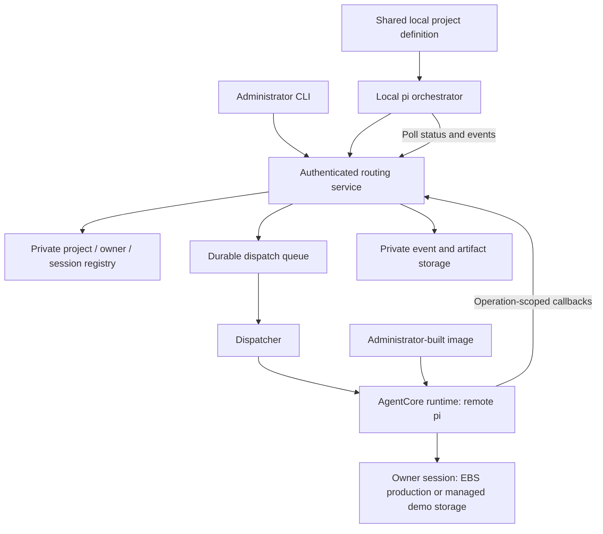

# Implementation Plan: AgentX Foundation

**Branch**: No Git branch created | **Date**: 2026-09-17 | **Spec**: [spec.md](spec.md)

**Input**: `specs/001-agentx-foundation/spec.md`

## Summary

Build a TypeScript CLI/TUI using pi for local orchestration and pi SDK workers deployed on
AgentCore. `instances-ebs` is the production target; `demo-microvm` is an explicitly bounded,
VPC-free demonstration profile. Administrators prepare versioned project definitions, runtime
images, and each developer's workspace before task acceptance. Each owner has independent
session-bound files and pi history. A small authenticated broker enforces ownership and routes
requests; it does not plan tasks or run a second orchestration agent.

## Technical Context

**Language/Version**: TypeScript, Node.js 22 or newer supported LTS; pin exact compatible
versions in T001/T002 rather than assuming current upstream main equals a released package.

**Primary Dependencies**: pi coding-agent SDK (verify released package namespace), AWS SDK
for JavaScript v3, Zod/YAML for configuration, Commander for CLI, Vitest for behavioral checks,
AWS CDK for infrastructure. Prefer pi's existing interactive mode over recreating its TUI.

**Storage**: Production uses per-session EBS at `/mnt/workspace`. The demo uses AgentCore
managed session storage at the same path, isolated by runtime session ID, with its documented
Preview retention limits. Pi JSONL sessions and operation journals live on the selected private
mount. DynamoDB stores trusted project/owner/session mappings, operation metadata and short
events; private S3 stores large artifacts through object-specific grants.

**Testing**: Unit/contract tests for ownership, validation, idempotency and tool restrictions;
local container integration for pi persistence; separately gated live AWS acceptance.

**Target Platform**: macOS/Linux client; Linux worker container on AgentCore. Production
Instances currently use the configured instance architecture; the microVM demo image is ARM64.
Docker is needed to build/test worker images, not to run the thin client.

**Project Type**: CLI/TUI, remote worker, authorization/routing service, infrastructure.

**Performance Goals**: Project validation under one second for four local definitions in a
warm process; visible active-task updates within five seconds in a healthy configured environment.
Measure cold provisioning separately; no unsupported instant-start promise.

**Constraints**: One active writer per workspace; no shared writable mounts across owners;
no local coding tools; no automatic Git publication; image digest pinned per workspace;
no automatic checkpoint subsystem. Do not assume nested Docker or Docker Compose support.

**Scale/Scope**: One company, four example products, two-owner acceptance scenario;
one default workspace per developer/project initially, many independent remote sessions.

## Constitution Check

| Principle | Design evidence | Pre-design | Post-design |
|---|---|---|---|
| Local orchestration | Explicit custom-tool allowlist and controlled resource loader | Pass | Pass |
| Administrator preparation | Register and prepare operations precede READY and task acceptance | Pass | Pass |
| Instance isolation | Broker-owned session mapping, separate sessions/volumes, denial tests | Pass | Pass |
| Durable state | EBS files and pi sessions; journal; explicit interruption reconciliation | Pass | Pass |
| Incremental delivery | Story-based tasks, fixture tests, separate live evidence | Pass | Pass |

No constitution exceptions are proposed. The constitution permits the named `demo-microvm`
profile but forbids using its evidence as proof of production EBS durability. Deployment inputs
remain configuration, not unresolved product behavior. The production acceptance path continues
to use the documented Instances APIs.

## Architecture and Trust Boundaries



Use API Gateway HTTP API with a configured JWT authorizer and Lambda for the broker.
Identity is derived from verified issuer and subject; admin membership is a configured verified
claim. Developers do not receive direct AgentCore invocation/command/stop permissions.
The broker resolves an internal random runtime session ID; it never accepts one from the client.

Use a transactional outbox and dispatcher (DynamoDB stream to SQS, then Lambda) so an accepted
operation cannot disappear between saving metadata and dispatch. Delivery is at least once;
worker acceptance/journaling deduplicates operation IDs. Runtime `/invocations` promptly
acknowledges accepted work and runs it in the background, with `/ping` reporting HealthyBusy.
The first version uses short polling with event cursors, avoiding a long-lived Lambda response.
Validate dispatch startup duration and provider retry behavior in the cloud spike.

The deployable control plane bundles TypeScript entry points rather than inline Lambda stubs.
Projects are registered after both stacks exist, so the administrator supplies the immutable
runtime binding with the project revision. This avoids a deployment cycle between the runtime's
callback URL and the dispatcher's runtime target. DynamoDB remains authoritative across Lambda
cold starts; only artifact bodies live in S3.

Worker execution roles must not grant arbitrary access to every user's registry, artifacts,
repository credentials, or other AgentCore sessions. Broker-issued short-lived operation
capabilities constrain callback writes and artifact grants to one workspace/operation; renewal
requires the existing bound capability and active operation. Repository credentials are
short-lived and limited to the configured repository/access grant. Runtime code has only the
model/network permissions it needs; the broker controls private shared-state access.

This boundary protects owners from each other. Coding processes inside a single workspace
are mutually trusted for MVP; isolating malicious code from its own agent credentials would
require a separately designed execution sandbox.

## Workspace and Task Lifecycle

1. Administrator builds/publishes the environment, registers a versioned project, grants access.
2. Administrator requests preparation for an owner; broker creates the instance record and
   session mapping, then dispatches an initialization-only invocation.
3. Worker initializes the mounted repository layout, runs approved setup/readiness commands,
   persists a preparation manifest, and marks the instance READY. No coding prompt runs.
4. `agentx --project payments` loads local config, authenticates, validates the server revision,
   and resolves the owner's ready instance. Missing preparation yields a clear admin action.
5. Submission atomically records an operation and takes the workspace writer lease.
6. Remote pi opens the selected conversation and working directory; files/events are persisted.
7. Follow-ups after completion open the same conversation. While busy, MVP returns a busy
   error; it does not launch a second writer. Cancellation is a separate control operation.
8. Reconnect retrieves status/events. Compute resume uses the same broker-owned runtime session
   ID and reopens history. Production remounts EBS; the demo restores managed session storage
   only within its retention/version limits. Lost processes mark ambiguous in-flight work
   INTERRUPTED and require reconciliation.
9. Stop retains storage within the selected profile's contract. Deletion and environment
   migration are explicit admin lifecycle concepts; destructive deletion and migration
   implementation are deferred.

A lease timeout alone must not launch another writer: confirm the prior worker is stopped or
has acknowledged cancellation before fencing and resuming. Exactly-once arbitrary shell side
effects cannot be guaranteed across crashes; record that uncertainty instead of replaying blindly.

## Project Structure

### Documentation (this feature)

```text
specs/001-agentx-foundation/
  spec.md
  plan.md
  research.md
  data-model.md
  quickstart.md
  contracts/
    project-config.md
    control-api.md
    worker-protocol.md
  checklists/requirements.md
  tasks.md
```

### Source Code (planned; not yet implemented)

```text
packages/
  contracts/src/       # Config, API messages, state and error schemas
  cli/src/             # Project loading, auth, admin commands, pi orchestration/TUI
  broker/src/          # Auth, ownership, registry, outbox, dispatch, callbacks
  worker/src/          # AgentCore adapter, setup, pi, persistence, controls
infra/
  bin/
  lib/
environments/
  base/Dockerfile
examples/
  projects/
tests/
  contract/
  integration/
  e2e/
  fixtures/
docs/
  decisions/
  operations.md
```

**Structure Decision**: An npm workspace shares protocol schemas while keeping local client,
broker and worker dependency boundaries explicit. No web frontend is needed.

## Delivery Sequence

1. Compatibility evidence and reproducible repository tooling.
2. Shared contracts, ownership enforcement, registry and dispatch foundation.
3. US1 administrator preparation and readiness.
4. US2 project selection and two-owner isolation.
5. US3 remote coding with progress/results: first useful coding milestone.
6. US4 persisted conversation and compute resumption.
7. US5 cancellation, busy behavior, stop and pinned revisions.
8. VPC-free microVM demo synthesis and local ARM64 container validation.
9. Production EBS live acceptance, documentation and Spec Kit convergence.

US1–US3 provide the first coding demonstration. The initial release is not complete until
US4–US5 and the isolation/persistence acceptance checks pass.

## Complexity Tracking

No constitutional violations. The broker is necessary because session IDs are routing values,
not authorization boundaries. The durable outbox is necessary to recover accepted work across
dispatch failure. Polling and a single writer reduce initial transport and concurrency complexity.
