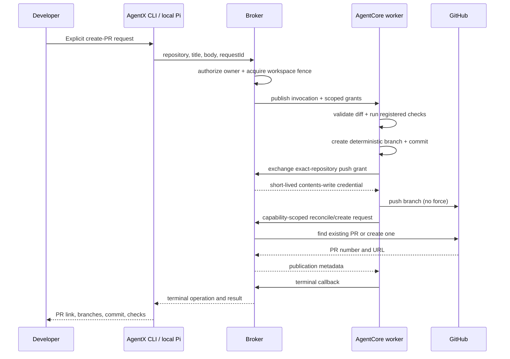

# Implementation Plan: Create Pull Request

**Branch**: `[002-create-pull-request]` | **Date**: 2026-09-19 | **Spec**: [spec.md](spec.md)

**Input**: Feature specification from `specs/002-create-pull-request/spec.md`

## Summary

Add an explicit, fenced `publish` operation that turns validated changes in one remote workspace
repository into one GitHub pull request. The broker authenticates the owner, acquires the existing
single-writer fence, generates a deterministic publication branch, and dispatches the operation.
The worker reruns registered readiness checks, rejects conflicts or an empty diff, creates an AgentX
commit, and pushes through a repository-scoped temporary credential. A capability-protected broker
endpoint reconciles or creates the pull request and returns non-secret publication metadata. The
CLI and local Pi orchestrator expose the same operation without acquiring local coding tools.

## Technical Context

**Language/Version**: TypeScript 5.9 on Node.js 22.19–22.x.

**Primary Dependencies**: Existing `@earendil-works/pi-coding-agent` 0.85.1,
AWS SDK v3.1134.0, Zod 4.3.6, Commander 14.0.3, AWS CDK 2.1114.1, Git 2.x, and GitHub REST API.

**Storage**: Existing DynamoDB workspace/operation/outbox records and worker operation journal;
repository files and commits remain in isolated AgentCore session storage. Persist only pull-request
metadata, never installation tokens or private keys.

**Testing**: Vitest contract and integration tests with temporary real Git repositories, fake
GitHub HTTP responses, retry/fence tests, infrastructure synthesis, and a separately gated live
GitHub App acceptance test.

**Target Platform**: macOS/Linux thin client; Linux ARM64 AgentCore demo worker; Node.js Lambda
control plane; GitHub repositories authenticated by the installed GitHub App.

**Project Type**: npm-workspace CLI/TUI, remote worker, authenticated control plane, and CDK stacks.

**Performance Goals**: Accept or deduplicate a publication request within two seconds excluding
runtime cold start; expose progress within five seconds; add no polling loop beyond existing
operation event polling. Check and Git durations remain project-dependent.

**Constraints**: One active writer; one repository and one ready-for-review pull request per
operation; no force push, merge, approval, branch deletion, local source access, durable token, or
automatic publication after a coding task. The demo workspace remains non-production durable.

**Scale/Scope**: One company installation, up to 32 configured repositories per project, one
selected repository per publication, and retry-safe at-least-once dispatch.

## Constitution Check

| Principle | Design evidence | Pre-design | Post-design |
|---|---|---|---|
| Local orchestration | CLI/Pi submit only a broker operation; Git and checks stay remote | Pass | Pass |
| Administrator preparation | Publication uses the registered repository, default branch, image, and readiness policy | Pass | Pass |
| Instance isolation | Owner authorization plus the existing workspace fence precedes dispatch | Pass | Pass |
| Durable state | Deterministic branch/operation identity and external reconciliation tolerate replacement | Pass | Pass |
| Incremental delivery | Single-repository PR is independently testable; multi-repo CI is deferred | Pass | Pass |

No constitution exception is proposed. Publication is explicit as required by Principles III and
IV. A signed repository grant is authorization metadata rather than a credential; installation
tokens remain ephemeral. Live demo evidence will remain distinct from production EBS evidence.

## Architecture and Trust Boundaries



The broker remains the only component with Secrets Manager access. It mints one token restricted
to the selected repository and `contents: write` for Git push, and a separate token restricted to
the selected repository and `pull_requests: write` for reconciliation/creation. The worker receives
only the push token via an operation-and-repository-scoped exchange and uses an ephemeral askpass
helper; the pull-request token never leaves the broker.

## Project Structure

### Documentation (this feature)

```text
specs/002-create-pull-request/
├── spec.md
├── plan.md
├── research.md
├── data-model.md
├── quickstart.md
├── contracts/
│   ├── control-api.md
│   ├── worker-protocol.md
│   └── cli.md
└── tasks.md
```

### Source Code (repository root)

```text
packages/contracts/src/
├── operation.ts              # publish request/result and operation kind
└── protocol.ts               # publish worker invocation
packages/broker/src/
├── github-app.ts             # permission-scoped tokens and PR reconciliation
├── operations.ts             # in-memory publication acceptance behavior
└── aws/broker.ts             # durable route, fence, outbox, internal PR endpoint
packages/worker/src/
├── publish.ts                # checks, branch, commit, push, PR callback
├── git-auth.ts               # ephemeral askpass shared by clone and push
├── repository-credentials.ts # access-scoped exchange client
└── main.ts                   # publish invocation dispatch
packages/cli/src/
├── pull-request.ts           # direct command workflow
├── control-plane-api.ts      # publication API call
├── orchestration-tools.ts    # local Pi publication tool
└── main.ts                   # `pr create` command
tests/
├── contract/                 # schemas, permissions, CLI/tool boundary, API behavior
└── integration/              # real-Git publication, failed checks, retry/idempotency
```

**Structure Decision**: Extend the existing workspace packages and operation pipeline. A new service
or CI platform is unnecessary for the first single-repository publication slice.

## Delivery Sequence

1. Extend contracts and behavioral fixtures for the publish operation and result.
2. Generalize GitHub App token scoping and implement broker-side PR reconciliation.
3. Implement worker validation, commit, credential-safe push, and callback behavior.
4. Add durable AWS acceptance, fencing, idempotency, and internal publication route.
5. Add direct CLI and local Pi orchestration tools.
6. Validate locally, update the worker image/control plane, and run live acceptance after the
   GitHub App permission upgrade is approved.

## Complexity Tracking

No constitutional violations. Splitting Git push from PR API access keeps the stronger
pull-request token inside the broker and is justified by the existing credential boundary.
